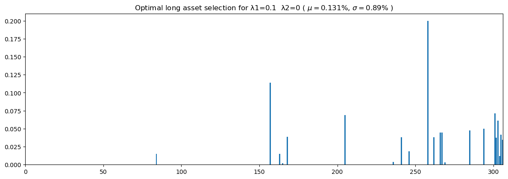

CS/ECE/ISyE 524 — Introduction to Optimization — Spring 2019
~~~~~~~~~~~~~~~~~~~~~~~~~~~~~~~~~~~~~~~~~~~~~~~~~~~~~~~~~~~~

Equity Valuation and Portfolio Optimization Using Modern Portfolio Theory
=========================================================================

Noah Dreikosen (njdreikosen@wisc.edu), Cole Thomson (cthomson4@wisc.edu), Ritik Goyal (ragoyal2@wisc.edu), and Zachary Easton (zeaston@wisc.edu)
^^^^^^^^^^^^^^^^^^^^^^^^^^^^^^^^^^^^^^^^^^^^^^^^^^^^^^^^^^^^^^^^^^^^^^^^^^^^^^^^^^^^^^^^^^^^^^^^^^^^^^^^^^^^^^^^^^^^^^^^^^^^^^^^^^^^^^^^^^^^^^^^

--------------

Table of Contents
~~~~~~~~~~~~~~~~~

1.  `Introduction <#1.-Introduction>`__
2.  `Mathematical Model <#2.-Mathematical-model>`__
3.  `Equity Valuation Model <#2.A.-Equity-valuation-model>`__
4.  `Markowitz Modern Portfolio
    Model <#2.B.-Markowitz-modern-portfolio-model>`__
5.  `Solution <#3.-Solution>`__
6.  `Results and Discussion <#4.-Results-and-discussion>`__
7.  `Standard Deviations and Expected Returns of Basket of
    Equities <#4.A.-Standard-deviations-and-expected-returns-of-basket-of-equities>`__
8.  `Optimal Portfolio Examples - Long
    Positions <#4.B.-Optimal-portfolio-examples---long-positions>`__
9.  `Optimal Portfolio Examples - Short
    Positions <#4.C.-Optimal-portfolio-examples---short-positions>`__
10. `Pareto Frontier <#4.D.-Pareto-Frontier>`__
11. `Accuracy of Models and Possible
    Improvements <#4.E.-Accuracy-of-models-and-possible-improvements>`__
12. `Conclusion <#5.-Conclusion>`__
13. `References <#6.-References>`__

1. Introduction
---------------

Approximately $169 billion dollars of stocks are traded daily on the
`New York Stock
Exchange <https://en.wikipedia.org/wiki/New_York_Stock_Exchange>`__. The
overall value of the companies traded in the U.S. stock market is $34
trillion. This equates to `roughly 43% of the value of all publicly
traded companies in the
world <https://www.nasdaq.com/article/us-stock-market-is-biggest-most-expensive-in-world-but-us-economy-is-not-the-most-productive-cm942558>`__
(Surz, 2018). Millions of investors look to buy (sell) companies that
they feel are undervalued (overvalued) so that they may sell (cover)
their position at some later date for a profit. To do this, traders and
investors must analyze thousands of stocks based on the expected risks
and returns, which can be done many different ways. One such strategy
that investors use, which will be examined in this project, combines
`Modern Portfolio
Theory <https://en.wikipedia.org/wiki/Modern_portfolio_theory>`__,
introduced by economist Harry Markowitz, with `Fundamental
Analysis <https://en.wikipedia.org/wiki/Fundamental_analysis>`__ of the
underlying factors that affect a stock's price - a method widely
advocated by investing juggernauts like `Benjamin
Graham <https://www.investopedia.com/articles/07/ben_graham.asp>`__ and
`Warren
Buffett <https://www.investopedia.com/university/warren-buffett-biography/>`__.

This project attempts to accomplish two main tasks. First, an absolute
equity (stock) valuation model is to be developed that receives
fundamental data of a company as parameters and returns the value of the
company. The value returned by the model is assumed to be the intrinsic
value of the company. This value can be compared to the market
capitalization (or market value - as determined by the company’s stock
price and number of outstanding shares) to determine if the stock is
under, over, or fair-valued. Second, an optimal portfolio is to be
developed using both the Markowitz Modern Portfolio Theory and the
valuation determined by the previous model. Both long (buying
securities) and short (selling securities by borrowing shares) optimal
portfolios are discussed and explored.

Benjamin Graham, and his famed prodigy Warren Buffett, have forged their
investment principles by leveraging fundamental characteristics (among a
few other ideas) of a company to determine its actual value.
`Fundamental
data <https://www.investopedia.com/articles/fundamental/03/022603.asp>`__
is any data that is expected to affect the perceived value of an equity
(McClure, 2019). Examples of fundamental data include: cash flow, return
on assets, earnings, debt levels, and many more. In total, there were 74
fundamental metrics used to develop the equity valuation model described
in this report. In this project, 1,230 samples were collected from years
2012 to 2016. Each of these samples are sourced from Form 10-K SEC
filings that companies must submit to shareholders on a yearly basis.
This dataset can be found on
`Kaggle <https://en.wikipedia.org/wiki/Kaggle>`__, an open source data
science community, from which both `fundamental
analysis <https://www.kaggle.com/dgawlik/nyse#fundamentals.csv>`__ and
`stock
price <https://www.kaggle.com/dgawlik/nyse#prices-split-adjusted.csv>`__
data is taken.

Harry Markowitz developed what is now known as `Modern Portfolio Theory
(MPT) <https://www.investopedia.com/terms/m/modernportfoliotheory.asp>`__
that was first published in The Journal of Finance in 1952 (Chen, 2019).
The model has various assumptions not discussed in this report, but is
rooted in the idea that choosing a group of investment equities which
collectively have lower risk than any single equity will have on its on
its own. Depending on investment goals, a tradeoff between the expected
returns of a portfolio and the risk of the associated portfolio can be
explored. An optimal portfolio lies on the Pareto frontier of `expected
returns and expected portfolio
risk <https://www.investopedia.com/terms/m/markowitzefficientset.asp>`__
(Kenton, 2018). In this project, we explore the addition of a third
tradeoff term to determine an optimal portfolio. This additional term is
the amount undervalued (or overvalued) of an equity as determined by our
equity valuation model. We explore different trade-offs to reflect
different investment styles in this report.

In the coming sections mathematical models, solution code (in Julia
1.1.0), discussion of results, and the conclusion of this optimization
project will be available.

2. Mathematical model
---------------------

2.A. Equity Valuation Model
~~~~~~~~~~~~~~~~~~~~~~~~~~~

**Type of Model:** Least Squares Regression

**Variables:**

Weights of each fundamental attribute to determine the value of a
company's stock:

.. math::

   \begin{aligned}
   & u_j && j=1,\dots,75
   \end{aligned}

**Parameters:**

Company *i* with fundamental attribute *j*:

.. math::

   \begin{aligned}
   & B_{i,j} && i=1,\dots,1230 \text{ and } j=1,\dots,75
   \end{aligned}

Market capitalization of company *i*:

.. math::

   \begin{aligned}
   & y_i && i=1,\dots,1230
   \end{aligned}

**Constraints:**

There exists no constraints for this model.

**Objective:**

We aim to find the curve that predicts the true value of a company based
on the company's current fundamental data. To accomplish this, we set
the objective to minimize the sum of squares between the companies'
current market capitalization (*y*) and the market capitalization
predicted by our model (*B x u*).

**Full Model:**

.. math::

   \begin{bmatrix}
     b_{1,1} & \dots & b_{1,75} \\
     \vdots & \ddots & \vdots \\
     b_{1232,1} & \dots & b_{1232,75}
   \end{bmatrix}
   \begin{bmatrix} u_{1} \\ \vdots \\ u_{75} \end{bmatrix} =
   \begin{bmatrix} y_{1} \\ \vdots \\ y_{1230} \end{bmatrix}

.. math::

   \begin{aligned}
   \underset{u}{\text{minimize}}\qquad& {||y-Bu||}^2\\
   \end{aligned}

2.B. Markowitz Modern Portfolio Model
~~~~~~~~~~~~~~~~~~~~~~~~~~~~~~~~~~~~~

**Type of Model:** Quadratic Program

**Variables:**

Proportion of total portfolio to invest in equity *i*:

.. math::

   \begin{aligned}
   & X_i && i=1,\dots,306
   \end{aligned}

**Parameters:**

Expected daily return of equity *i* as a percentage:

.. math::

   \begin{aligned}
   & \mu_i && i=1,\dots,306
   \end{aligned}

Covariance between equity *i* and equity *j* (used to measure risk):

.. math::

   \begin{aligned}
   & \Sigma_i && i=1,\dots,306
   \end{aligned}

Percent difference between the estimated value of the company and the
current market capitalization of the company (obtained from Equity
Valuation Model):

.. math::

   \begin{aligned}
   & {\Delta}_i && i=1,\dots,306
   \end{aligned}

Tradeoff weights for covariance matrix (risk) and the percent under/over
valued determined by the Equity Valuation Model:

.. math::

   \begin{aligned}
   & \lambda_1 && \lambda_2
   \end{aligned}

**Constraints:**

**For Long Portfolio:** The amount invested in each company must be
non-negative, and no single investment may exceed 20% of the total
portfolio:

.. math::

   \begin{aligned}
   & 0 \le X_i \le 0.2 && i=1,\dots,306
   \end{aligned}

The portfolio is allocated to 100% capacity:

.. math::

   \begin{aligned}
   & \sum_{i=1}^{306}X_i = 1
   \end{aligned}

**For Short-only Portfolio:**

The amount invested in each company must be non-positive, and no single
investment may exceed 20% of the total portfolio:

.. math::

   \begin{aligned}
   & -0.2 \le X_i \le 0 && i=1,\dots,306
   \end{aligned}

The portfolio is allocated to 100% capacity:

.. math::

   \begin{aligned}
   & \sum_{i=1}^{306}X_i = -1
   \end{aligned}

**Objective:**

For a Long porfolio, we aim to maximize the total expected return of the
portfolio, minimize the risk, and maximize the percent difference
between estimated stock valuation and the current market valuation. For
a Short-Only portfolio, we aim to minimize the total expected return of
the portfolio, minimize the risk of the entire portfolio, and minimize
the percent difference between estimated stock valuation and the current
market valuation. This results in a trade-off problem in which weights
will be chosen depending on a person's risk tolerance.

**Full Model:**

Model for Long Portfolio:

.. math::

   \begin{aligned}
   \underset{x}{\text{minimize}}\qquad& -({\mu^\intercal}x)+\lambda_{1}({x^\intercal}({\Sigma}x))-\lambda_{2}({\Delta^\intercal}x)\\
   \text{subject to:}\qquad& \sum{x} = 1\\
   & 0 \le x_i \le 0.2 \quad i=1,\dots,306
   \end{aligned}

Model for Short-only Portfolio:

.. math::

   \begin{aligned}
   \underset{x}{\text{minimize}}\qquad& -({\mu^\intercal}x)+\lambda_{1}({x^\intercal}({\Sigma}x))-\lambda_{2}({\Delta^\intercal}x)\\
   \text{subject to:}\qquad& \sum{x} = -1\\
   & -0.2 \le x_i \le 0 \quad i=1,\dots,306
   \end{aligned}

3. Solution
-----------

To expand on the possibilities for an optimal portfolio, we decided to
construct both an optimal long position portfolio as well as an optimal
short position portfolio. A fund manager may desire to allocate a
portfolio to only short-positions to hedge themselves against their long
positions and/or possible economic factors like a recession that might
pull many of the stocks in the market lower. The traditional
“buy-and-hold” investor may find that the long-only optimal portfolio is
better suited for their needs. In addition, the short portfolio is
neglecting some important as pects of borrowing shares including:
borrowing rates, availability of shares to borrow, potential margin
calls, etc. The potential loss on a short investment is theoretically
unbounded, but we do not discuss these assumptions and technicalities in
this report. An investor looking to short securities in practice would
need to obtain a deeper understanding of the subject before attempting
any endeavor.

The Equity Valuation Model is first constructed, since its results will
be used in the Markowitz Optimal Portfolio models. It was desired by our
group to obtain solutions that were “real”, so only real market data was
used throughout the analysis. To build the Equity Valuation Model, we
used 5 years worth of data (1,230 samples) to essentially train our LS
Regression Model. By using the optimal weights for each fundamental
characteristic, we are then able to estimate the value of a company by
applying the weights to the fundamental data of any given company. Since
the market capitalization is always known for each stock (market
capitalization = # shares outstanding \* share price), we can compare
the estimated value from our model with the current market
capitalization to determine if an equity is currently under/over or
fair-valued. However, since the price of companies can vary widely, it
was necessary that we looked at a relative measure of value difference
instead of an absolute one. This meant looking at the percent difference
of our expected price and the current price instead of simply taking the
difference. Once we obtained a vector of calculated percent differences,
we could then insert this information into the Markowitz Optimal
Portfolio models.

When considering an optimal portfolio for long positions, we concerned
our model with three different objectives: maximize expected returns,
minimize risk, and maximizing the percent undervalued that a company is
as determined by the previous model. It became necessary to model the
objective function as a tradeoff between these three terms since all of
them could not be solved to their absolute optimum simultaneously. Later
in the report we will explore how different tradeoffs affect optimal
portfolio composition as well as performance. Daily expected return data
was collected for 306 equities and a covariance matrix of these equities
was constructed. After having all pieces for the objective needed, we
looked at reasonable constraints for the model. To ensure at least some
diversification, we did not allow that more than 20% of the portfolio to
be invested in any one stock. We also enforced that the entire portfolio
be allocated completely. The long and short portfolios were constructed
identically with the exception of desiring to maximize the percent
overvalued that a stock is in the objective function.

To access the accuracy of our models, a test set of the 306 equities was
gathered from the year 2014. A validation set was constructed with the
same 306 equites for the year 2015. Optimal long and short portfolios
were then constructed using the test set. Under the assumption that the
portfolio was held for a year, we analyzed the results using the
validation set.

.. code:: julia

    # Helper function to calculate total profits and portfolio returns as a percent for each company 
    # selected by the model using what price the stocks were bought and sold at and the percent invested of the portfolio.
    using DataFrames
    
    function check_profits(ix, amount, prices_test, prices_val, xsol)
        profit = 0
        exp_returns = 0
        init_vals = prices_test[:,1] .* prices_test[:,2]
        final_vals = prices_val[:,1] .* prices_val[:,2]
        df = DataFrame()
        
        company_arr = []
        init_vals_arr = []
        final_vals_arr =[]
        invested_arr = []
        profit_arr = []
        
        for i in 1:length(ix)
            company = tickers[ix[i]]
            # Price - Valuation of company
            init_price = init_vals[ix[i]]
            final_price = final_vals[ix[i]]
            percent_invested = xsol[ix1[i]]
            #println("Percent invested: ", percent_invested)
            percent_invested = abs(percent_invested)
            invested = percent_invested*amount
            num_stocks = invested/init_price
            final_sell_price = num_stocks*final_price
            diff = final_sell_price - invested
            profit+=diff
            
            push!(company_arr, company)
            push!(init_vals_arr, init_price)
            push!(final_vals_arr, final_price)
            push!(invested_arr, percent_invested)
            push!(profit_arr, diff)
            
        end
        exp_returns = profit/amount
        
        df[:Companies] = company_arr
        df[:Valuation_when_bought] = init_vals_arr
        df[:Valuation_when_sold] = final_vals_arr
        df[:Percent_invested] = invested_arr
        df[:Returns] = profit_arr    
        println("Portfolio returns (percent) ", exp_returns)
        return df
    end

.. parsed-literal::

    check_profits (generic function with 1 method)

.. code:: julia

    # Calculates the bias offset (difference) between the predicted valuation and actual valuation of a company while training the linear regression model.
    function get_bias_diff(train, coeffs, test)
        actual_prices = train[78]
        num_shares = train[77]
        actual_valuations = actual_prices .* num_shares
        raw_temp = re_normalize(train)
        exp_valuations = raw_temp * coeffs
        bias = []
        for s in test[:,1]
            sum_diff_valuations = 0
            count = 0
            for i in 1:length(train[:,1])
                if train[i,1] == s
                    sum_diff_valuations += exp_valuations[i] - actual_valuations[i]
                    count += 1
                end
            end
            if count == 0
                avg = 0
            else
                avg = sum_diff_valuations/count
            end
            push!(bias, avg)
        end
        
        return bias
    end

.. parsed-literal::

    get_bias_diff (generic function with 1 method)

.. code:: julia

    # Helper function to calculate difference between expected prices calculated by the model and actual prices as a percent
    # for each company.
    using LinearAlgebra
    
    function get_diff_expected_prices(coeffs, raw_test, test_company_num)
        test_comp_name = raw_test[1][test_company_num]
        actual_prices = raw_test[78]
        num_shares = raw_test[77]
        actual_valuations = actual_prices .* num_shares
        raw_temp = re_normalize(raw_test) #normalize by scaling using the same scale factor    
        exp_valuations = raw_temp * coeffs #Calculate expected valuations by multiplying with our coefficients from the LS regression
        println("Calculated valuation for ", test_comp_name,  " before bias correction: ", exp_valuations[test_company_num])
        exp_valuations = exp_valuations - bias
        
        exp_prices = exp_valuations ./ num_shares
        diff = (exp_prices - actual_prices)./actual_prices
        println("Expected (calculated) valuation for ", test_comp_name,  " with bias correction: ", exp_valuations[test_company_num])
        println("Actual valuation for ", test_comp_name,  ": ", actual_valuations[test_company_num])
        println("Bias: ", bias[test_company_num])
        return diff
    end

.. parsed-literal::

    get_diff_expected_prices (generic function with 1 method)

.. code:: julia

    # Helper function that takes in dataframe and returns columns 3 thru 76, normalized as a matrix.
    using Statistics
    # Scale is 75 because of an added term for intercept.
    scale = ones(75)
    function normalize(data)
        newdata = ones(length(data[:,1]), 75)
    
        for i in 3:76
            maxval = abs(maximum(data[:,i]))
            minval = abs(minimum(data[:,i]))
    
            #Normalizing the columns by dividing by maximum value so that all values are between -1 and 1
            if maxval != 0
                newdata[:,i-2] = data[:,i]/maxval
                scale[i-2] = maxval
            elseif minval != 0
                newdata[:,i-2] = data[:,i]/minval
                scale[i-2] = minval
                else #This branch will never really execute, but added it in just in case
                mean = mean(data[:,i])
                newdata[:,i-2] = data[:,i]/mean
                scale[i-2] = mean
            end
        end
        return newdata
    end

.. parsed-literal::

    normalize (generic function with 1 method)

.. code:: julia

    # Helper Function to normalize test data by scaling with the same factor as train data.
    function re_normalize(test)
        newdata = ones(length(test[:,1]), 75)
        
        for i in 3:76
            newdata[:, i-2] = test[:,i]
        end
        
        newdata = newdata ./ scale'
        return newdata
    end

.. parsed-literal::

    re_normalize (generic function with 1 method)

.. code:: julia

    # CSV used to read in data from .csv files.
    using CSV
    file1 = "./fundementals_with_ratios_training_set.csv"
    file2 = "./fundementals_with_ratios_testing_set.csv"
    file3 = "./fundementals_with_ratios_validation_set.csv"
    raw_train = CSV.read(file1);
    raw_test = CSV.read(file2);
    raw_val = CSV.read(file3);
    
    # Merge the data into one dataframe. We will use this in our least squares model.
    raw = vcat(raw_train, raw_test, raw_val)

.. raw:: html

    <table class="data-frame"><thead><tr><th></th><th>Ticker Symbol</th><th>Period Ending</th><th>Accounts Payable</th><th>Accounts Receivable</th><th>Add'l income/expense items</th><th>After Tax ROE</th><th>Capital Expenditures</th><th>Capital Surplus</th><th>Cash Ratio</th><th>Cash and Cash Equivalents</th><th>Changes in Inventories</th><th>Common Stocks</th><th>Cost of Revenue</th><th>Current Ratio</th><th>Deferred Asset Charges</th><th>Deferred Liability Charges</th><th>Depreciation</th><th>Earnings Before Interest and Tax</th><th>Earnings Before Tax</th><th>Effect of Exchange Rate</th><th>Equity Earnings/Loss Unconsolidated Subsidiary</th><th>Fixed Assets</th><th>Goodwill</th><th>Gross Margin</th><th>Gross Profit</th><th>Income Tax</th><th>Intangible Assets</th><th>Interest Expense</th><th>Inventory</th><th>Investments</th><th>Liabilities</th><th>Long-Term Debt</th><th>Long-Term Investments</th><th>Minority Interest</th><th>Misc. Stocks</th><th>Net Borrowings</th><th>Net Cash Flow</th><th>Net Cash Flow-Operating</th><th>Net Cash Flows-Financing</th><th>Net Cash Flows-Investing</th><th>Net Income</th><th>Net Income Adjustments</th><th>Net Income Applicable to Common Shareholders</th><th>Net Income-Cont. Operations</th><th>Net Receivables</th><th>Non-Recurring Items</th><th>Operating Income</th><th>Operating Margin</th><th>Other Assets</th><th>Other Current Assets</th><th>Other Current Liabilities</th><th>Other Equity</th><th>Other Financing Activities</th><th>Other Investing Activities</th><th>Other Liabilities</th><th>Other Operating Activities</th><th>Other Operating Items</th><th>Pre-Tax Margin</th><th>Pre-Tax ROE</th><th>Profit Margin</th><th>Quick Ratio</th><th>Research and Development</th><th>Retained Earnings</th><th>Sale and Purchase of Stock</th><th>Sales, General and Admin.</th><th>Short-Term Debt / Current Portion of Long-Term Debt</th><th>Short-Term Investments</th><th>Total Assets</th><th>Total Current Assets</th><th>Total Current Liabilities</th><th>Total Equity</th><th>Total Liabilities</th><th>Total Liabilities &amp; Equity</th><th>Total Revenue</th><th>Treasury Stock</th><th>Earnings Per Share</th><th>Estimated Shares Outstanding</th><th>Close</th></tr><tr><th></th><th>String⍰</th><th>Dates…⍰</th><th>Int64⍰</th><th>Int64⍰</th><th>Int64⍰</th><th>Int64⍰</th><th>Int64⍰</th><th>Int64⍰</th><th>Int64⍰</th><th>Int64⍰</th><th>Int64⍰</th><th>Int64⍰</th><th>Float64⍰</th><th>Int64⍰</th><th>Int64⍰</th><th>Int64⍰</th><th>Int64⍰</th><th>Int64⍰</th><th>Int64⍰</th><th>Int64⍰</th><th>Int64⍰</th><th>Float64⍰</th><th>Float64⍰</th><th>Int64⍰</th><th>Float64⍰</th><th>Int64⍰</th><th>Float64⍰</th><th>Int64⍰</th><th>Int64⍰</th><th>Int64⍰</th><th>Int64⍰</th><th>Float64⍰</th><th>Float64⍰</th><th>Int64⍰</th><th>Int64⍰</th><th>Int64⍰</th><th>Int64⍰</th><th>Int64⍰</th><th>Int64⍰</th><th>Int64⍰</th><th>Int64⍰</th><th>Int64⍰</th><th>Int64⍰</th><th>Int64⍰</th><th>Int64⍰</th><th>Int64⍰</th><th>Int64⍰</th><th>Int64⍰</th><th>Int64⍰</th><th>Int64⍰</th><th>Int64⍰</th><th>Int64⍰</th><th>Int64⍰</th><th>Int64⍰</th><th>Int64⍰</th><th>Int64⍰</th><th>Int64⍰</th><th>Int64⍰</th><th>Int64⍰</th><th>Int64⍰</th><th>Int64⍰</th><th>Int64⍰</th><th>Float64⍰</th><th>Int64⍰</th><th>Int64⍰</th><th>Int64⍰</th><th>Float64⍰</th><th>Float64⍰</th><th>Float64⍰</th><th>Int64⍰</th><th>Float64⍰</th><th>Float64⍰</th><th>Float64⍰</th><th>Float64⍰</th><th>Float64⍰</th><th>Float64⍰</th><th>Float64⍰</th><th>Float64⍰</th></tr></thead><tbody>
1,230 rows × 78 columns
<tr><th>1</th><td>AAL</td><td>2012-12-31</td><td>3068000000</td><td>-222000000</td><td>-1961000000</td><td>23</td><td>-1888000000</td><td>4695000000</td><td>53</td><td>1330000000</td><td>0</td><td>127000000</td><td>1.0499e10</td><td>78</td><td>0</td><td>223000000</td><td>1001000000</td><td>-1813000000</td><td>-2445000000</td><td>0</td><td>0</td><td>1.3402e10</td><td>0.0</td><td>58</td><td>1.4356e10</td><td>-569000000</td><td>8.69e8</td><td>632000000</td><td>580000000</td><td>306000000</td><td>473000000</td><td>7.116e9</td><td>0.0</td><td>0</td><td>0</td><td>-1020000000</td><td>197000000</td><td>1285000000</td><td>483000000</td><td>-1571000000</td><td>-1876000000</td><td>2050000000</td><td>-1876000000</td><td>-4084000000</td><td>1124000000</td><td>386000000</td><td>148000000</td><td>1</td><td>2167000000</td><td>626000000</td><td>4524000000</td><td>-2980000000</td><td>1509000000</td><td>11000000</td><td>15147000000</td><td>-141000000</td><td>845000000</td><td>10</td><td>31</td><td>8</td><td>72</td><td>0</td><td>-9.462e9</td><td>0</td><td>12977000000</td><td>1419000000</td><td>3.412e9</td><td>2.351e10</td><td>7.072e9</td><td>9011000000</td><td>-7.987e9</td><td>2.4891e10</td><td>1.6904e10</td><td>2.4855e10</td><td>-3.67e8</td><td>-5.6</td><td>3.35e8</td><td>13.5</td></tr><tr><th>2</th><td>AAL</td><td>2013-12-31</td><td>4975000000</td><td>-93000000</td><td>-2723000000</td><td>67</td><td>-3114000000</td><td>10592000000</td><td>75</td><td>2175000000</td><td>0</td><td>5000000</td><td>1.1019e10</td><td>104</td><td>0</td><td>935000000</td><td>1020000000</td><td>-1324000000</td><td>-2180000000</td><td>0</td><td>0</td><td>1.9259e10</td><td>4.086e9</td><td>59</td><td>1.5724e10</td><td>-346000000</td><td>2.311e9</td><td>856000000</td><td>1012000000</td><td>-1181000000</td><td>-235000000</td><td>1.5353e10</td><td>0.0</td><td>0</td><td>0</td><td>2208000000</td><td>660000000</td><td>675000000</td><td>3799000000</td><td>-3814000000</td><td>-1834000000</td><td>1873000000</td><td>-1834000000</td><td>-4489000000</td><td>1560000000</td><td>559000000</td><td>1399000000</td><td>5</td><td>2299000000</td><td>1465000000</td><td>7385000000</td><td>-2032000000</td><td>1711000000</td><td>481000000</td><td>14915000000</td><td>-56000000</td><td>853000000</td><td>8</td><td>80</td><td>7</td><td>96</td><td>0</td><td>-1.1296e10</td><td>0</td><td>12913000000</td><td>1446000000</td><td>8.111e9</td><td>4.2278e10</td><td>1.4323e10</td><td>13806000000</td><td>-2.731e9</td><td>4.5009e10</td><td>4.2278e10</td><td>2.6743e10</td><td>0.0</td><td>-11.25</td><td>1.63022e8</td><td>25.25</td></tr><tr><th>3</th><td>AAP</td><td>2012-12-29</td><td>2409453000</td><td>-89482000</td><td>600000</td><td>32</td><td>-271182000</td><td>520215000</td><td>23</td><td>598111000</td><td>-260298000</td><td>7000</td><td>3.10697e9</td><td>124</td><td>0</td><td>0</td><td>189544000</td><td>657915000</td><td>624074000</td><td>0</td><td>0</td><td>1.29255e9</td><td>7.6389e7</td><td>50</td><td>3.09804e9</td><td>236404000</td><td>2.8845e7</td><td>33841000</td><td>2308609000</td><td>0</td><td>426323000</td><td>6.04461e8</td><td>0.0</td><td>0</td><td>0</td><td>177445000</td><td>540210000</td><td>685281000</td><td>127907000</td><td>-272978000</td><td>387670000</td><td>23311000</td><td>387670000</td><td>387670000</td><td>229866000</td><td>0</td><td>657315000</td><td>11</td><td>31833000</td><td>47614000</td><td>149558000</td><td>2667000</td><td>-33499000</td><td>-1796000</td><td>239021000</td><td>8213000</td><td>0</td><td>10</td><td>52</td><td>6</td><td>34</td><td>0</td><td>7.149e8</td><td>-18600000</td><td>2440721000</td><td>627000</td><td>0.0</td><td>4.61381e9</td><td>3.1842e9</td><td>2559638000</td><td>1.21069e9</td><td>3.40312e9</td><td>4.61381e9</td><td>6.205e9</td><td>-2.7095e7</td><td>5.29</td><td>7.32836e7</td><td>71.51</td></tr><tr><th>4</th><td>AAP</td><td>2013-12-28</td><td>2609239000</td><td>-32428000</td><td>2698000</td><td>26</td><td>-195757000</td><td>531293000</td><td>40</td><td>1112471000</td><td>-203513000</td><td>7000</td><td>3.24167e9</td><td>144</td><td>0</td><td>0</td><td>207795000</td><td>663016000</td><td>626398000</td><td>0</td><td>0</td><td>1.28603e9</td><td>1.99835e8</td><td>50</td><td>3.25215e9</td><td>234640000</td><td>4.9872e7</td><td>36618000</td><td>2556557000</td><td>0</td><td>172715000</td><td>1.05267e9</td><td>0.0</td><td>0</td><td>0</td><td>445679000</td><td>514360000</td><td>545250000</td><td>331217000</td><td>-362107000</td><td>391758000</td><td>-2088000</td><td>391758000</td><td>391758000</td><td>277595000</td><td>0</td><td>660318000</td><td>10</td><td>39649000</td><td>42761000</td><td>154630000</td><td>3683000</td><td>-27209000</td><td>-166350000</td><td>231116000</td><td>11011000</td><td>0</td><td>10</td><td>41</td><td>6</td><td>52</td><td>0</td><td>1.08911e9</td><td>-77184000</td><td>2591828000</td><td>916000</td><td>0.0</td><td>5.56477e9</td><td>3.98938e9</td><td>2764785000</td><td>1.51621e9</td><td>4.04857e9</td><td>5.56477e9</td><td>6.49381e9</td><td>-1.0789e8</td><td>5.36</td><td>7.30892e7</td><td>109.92</td></tr><tr><th>5</th><td>AAP</td><td>2016-01-02</td><td>3757085000</td><td>-21476000</td><td>-7484000</td><td>19</td><td>-234747000</td><td>603332000</td><td>2</td><td>90782000</td><td>-244096000</td><td>7000</td><td>5.31425e9</td><td>130</td><td>0</td><td>433925000</td><td>269476000</td><td>818296000</td><td>752888000</td><td>-4213000</td><td>0</td><td>1.43458e9</td><td>9.89484e8</td><td>45</td><td>4.42277e9</td><td>279490000</td><td>6.87125e8</td><td>65408000</td><td>4174768000</td><td>0</td><td>174667000</td><td>1.21316e9</td><td>0.0</td><td>0</td><td>0</td><td>-426322000</td><td>-13889000</td><td>689642000</td><td>-445952000</td><td>-253366000</td><td>473398000</td><td>30250000</td><td>473398000</td><td>473398000</td><td>597788000</td><td>0</td><td>825780000</td><td>8</td><td>82633000</td><td>77408000</td><td>39794000</td><td>-44059000</td><td>-13492000</td><td>-18619000</td><td>229354000</td><td>7423000</td><td>0</td><td>8</td><td>31</td><td>5</td><td>20</td><td>0</td><td>2.02108e9</td><td>-1491000</td><td>3596992000</td><td>598000</td><td>0.0</td><td>8.13457e9</td><td>4.94075e9</td><td>3797477000</td><td>2.46065e9</td><td>5.67392e9</td><td>8.13457e9</td><td>9.73702e9</td><td>-1.19709e8</td><td>6.45</td><td>7.3395e7</td><td>150.51</td></tr><tr><th>6</th><td>AAPL</td><td>2013-09-28</td><td>36223000000</td><td>-1949000000</td><td>1156000000</td><td>30</td><td>-8165000000</td><td>0</td><td>93</td><td>14259000000</td><td>-973000000</td><td>19764000000</td><td>1.07e11</td><td>168</td><td>0</td><td>2625000000</td><td>6757000000</td><td>50155000000</td><td>50155000000</td><td>0</td><td>0</td><td>1.6597e10</td><td>1.577e9</td><td>38</td><td>6.4304e10</td><td>13118000000</td><td>4.179e9</td><td>0</td><td>1764000000</td><td>-24042000000</td><td>8320000000</td><td>1.696e10</td><td>1.06e11</td><td>0</td><td>0</td><td>16896000000</td><td>3513000000</td><td>53666000000</td><td>-16379000000</td><td>-33774000000</td><td>37037000000</td><td>3394000000</td><td>37037000000</td><td>37037000000</td><td>24094000000</td><td>0</td><td>48999000000</td><td>29</td><td>5146000000</td><td>6882000000</td><td>7435000000</td><td>-471000000</td><td>-1082000000</td><td>-1567000000</td><td>20208000000</td><td>1080000000</td><td>0</td><td>29</td><td>41</td><td>22</td><td>164</td><td>4475000000</td><td>1.04e11</td><td>-22330000000</td><td>10830000000</td><td>0</td><td>2.6287e10</td><td>2.07e11</td><td>7.3286e10</td><td>43658000000</td><td>1.24e11</td><td>8.3451e10</td><td>2.07e11</td><td>1.71e11</td><td>0.0</td><td>40.03</td><td>9.25231e8</td><td>482.75</td></tr><tr><th>7</th><td>AAPL</td><td>2016-09-24</td><td>59321000000</td><td>1044000000</td><td>1348000000</td><td>36</td><td>-12734000000</td><td>0</td><td>85</td><td>20484000000</td><td>217000000</td><td>31251000000</td><td>1.31e11</td><td>135</td><td>0</td><td>2930000000</td><td>10505000000</td><td>61372000000</td><td>61372000000</td><td>0</td><td>0</td><td>2.701e10</td><td>5.414e9</td><td>39</td><td>8.4263e10</td><td>15685000000</td><td>3.206e9</td><td>0</td><td>2132000000</td><td>-32022000000</td><td>-1867000000</td><td>7.5427e10</td><td>1.7e11</td><td>0</td><td>0</td><td>22057000000</td><td>-636000000</td><td>65824000000</td><td>-20483000000</td><td>-45977000000</td><td>45687000000</td><td>9148000000</td><td>45687000000</td><td>45687000000</td><td>29299000000</td><td>0</td><td>60024000000</td><td>28</td><td>8757000000</td><td>8283000000</td><td>8080000000</td><td>634000000</td><td>-1570000000</td><td>-1221000000</td><td>36074000000</td><td>1090000000</td><td>0</td><td>28</td><td>48</td><td>21</td><td>133</td><td>10045000000</td><td>9.6364e10</td><td>-29227000000</td><td>14194000000</td><td>11605000000</td><td>4.6671e10</td><td>3.22e11</td><td>1.07e11</td><td>79006000000</td><td>1.28e11</td><td>1.93e11</td><td>3.22e11</td><td>2.16e11</td><td>0.0</td><td>8.35</td><td>5.4715e9</td><td>112.71</td></tr><tr><th>8</th><td>ABBV</td><td>2013-12-31</td><td>6448000000</td><td>681000000</td><td>-54000000</td><td>92</td><td>-491000000</td><td>3671000000</td><td>144</td><td>9595000000</td><td>-56000000</td><td>16000000</td><td>4.581e9</td><td>259</td><td>0</td><td>0</td><td>897000000</td><td>5610000000</td><td>5332000000</td><td>-10000000</td><td>0</td><td>2.298e9</td><td>6.277e9</td><td>76</td><td>1.4209e10</td><td>1204000000</td><td>1.89e9</td><td>278000000</td><td>1150000000</td><td>1775000000</td><td>-426000000</td><td>1.4292e10</td><td>1.18e8</td><td>0</td><td>0</td><td>-601000000</td><td>3694000000</td><td>6267000000</td><td>-3442000000</td><td>879000000</td><td>4128000000</td><td>584000000</td><td>4128000000</td><td>4128000000</td><td>5569000000</td><td>338000000</td><td>5664000000</td><td>30</td><td>767000000</td><td>1234000000</td><td>0</td><td>-442000000</td><td>-313000000</td><td>-405000000</td><td>3535000000</td><td>459000000</td><td>0</td><td>28</td><td>119</td><td>22</td><td>243</td><td>2855000000</td><td>1.567e9</td><td>27000000</td><td>5352000000</td><td>431000000</td><td>3.0e8</td><td>2.9198e10</td><td>1.7848e10</td><td>6879000000</td><td>4.492e9</td><td>2.4706e10</td><td>2.9198e10</td><td>1.879e10</td><td>-3.2e8</td><td>2.58</td><td>1.6e9</td><td>52.81</td></tr><tr><th>9</th><td>ABC</td><td>2013-09-30</td><td>14870635000</td><td>-2312518000</td><td>-44000</td><td>19</td><td>-202450000</td><td>2360992000</td><td>8</td><td>1231006000</td><td>-1486572000</td><td>2678000</td><td>8.54513e10</td><td>97</td><td>0</td><td>0</td><td>170793000</td><td>898355000</td><td>824458000</td><td>0</td><td>0</td><td>8.03561e8</td><td>0.0</td><td>3</td><td>2.50782e9</td><td>331023000</td><td>3.49971e9</td><td>73897000</td><td>6981494000</td><td>0</td><td>3830847000</td><td>1.39661e9</td><td>0.0</td><td>0</td><td>0</td><td>0</td><td>164398000</td><td>788125000</td><td>-740987000</td><td>117260000</td><td>433707000</td><td>235476000</td><td>433707000</td><td>493435000</td><td>6051920000</td><td>0</td><td>898399000</td><td>1</td><td>221713000</td><td>129231000</td><td>0</td><td>-35483000</td><td>-50538000</td><td>319710000</td><td>331652000</td><td>-169745000</td><td>162186000</td><td>1</td><td>36</td><td>0</td><td>50</td><td>0</td><td>1.50841e9</td><td>-328463000</td><td>1447234000</td><td>0</td><td>0.0</td><td>1.89186e10</td><td>1.43937e10</td><td>14870635000</td><td>2.31975e9</td><td>1.65989e10</td><td>1.89186e10</td><td>8.79592e10</td><td>-1.51686e9</td><td>1.88</td><td>2.30695e8</td><td>61.1</td></tr><tr><th>10</th><td>ABC</td><td>2016-09-30</td><td>24670159000</td><td>-912724000</td><td>5048000</td><td>67</td><td>-464616000</td><td>4333001000</td><td>11</td><td>2741832000</td><td>-1107252000</td><td>2778000</td><td>1.43e11</td><td>90</td><td>0</td><td>2214774000</td><td>392166000</td><td>1530822000</td><td>1390910000</td><td>0</td><td>0</td><td>1.53068e9</td><td>5.9915e9</td><td>3</td><td>4.27261e9</td><td>-37019000</td><td>2.96785e9</td><td>139912000</td><td>10723920000</td><td>40712000</td><td>3094340000</td><td>3.87024e9</td><td>0.0</td><td>0</td><td>0</td><td>713214000</td><td>574390000</td><td>3178497000</td><td>565072000</td><td>-3169179000</td><td>1427929000</td><td>330197000</td><td>1427929000</td><td>1427929000</td><td>9175876000</td><td>0</td><td>1525774000</td><td>1</td><td>314325000</td><td>210219000</td><td>0</td><td>-114308000</td><td>0</td><td>-2745275000</td><td>160470000</td><td>-46159000</td><td>364735000</td><td>1</td><td>65</td><td>1</td><td>48</td><td>0</td><td>2.30394e9</td><td>168903000</td><td>2382097000</td><td>611149000</td><td>0.0</td><td>3.36562e10</td><td>2.28518e10</td><td>25281308000</td><td>2.1294e9</td><td>3.15268e10</td><td>3.36562e10</td><td>1.47e11</td><td>-4.39601e9</td><td>6.73</td><td>2.12174e8</td><td>80.78</td></tr><tr><th>11</th><td>ABT</td><td>2012-12-31</td><td>10889000000</td><td>36000000</td><td>-1260000000</td><td>22</td><td>-1795000000</td><td>0</td><td>114</td><td>10802000000</td><td>-417000000</td><td>11755000000</td><td>8.899e9</td><td>236</td><td>3213000000</td><td>0</td><td>2782000000</td><td>100000000</td><td>-220000000</td><td>40000000</td><td>0</td><td>8.063e9</td><td>1.5774e10</td><td>53</td><td>1.0151e10</td><td>-457000000</td><td>8.588e9</td><td>320000000</td><td>3793000000</td><td>-3062000000</td><td>-1443000000</td><td>1.8085e10</td><td>2.74e8</td><td>92000000</td><td>0</td><td>4413000000</td><td>3989000000</td><td>9314000000</td><td>195000000</td><td>-5560000000</td><td>5963000000</td><td>2428000000</td><td>5963000000</td><td>237000000</td><td>10599000000</td><td>0</td><td>1360000000</td><td>7</td><td>0</td><td>1757000000</td><td>0</td><td>-3594000000</td><td>-521000000</td><td>-703000000</td><td>9057000000</td><td>-35000000</td><td>595000000</td><td>1</td><td>1</td><td>31</td><td>207</td><td>1461000000</td><td>2.4151e10</td><td>-514000000</td><td>6735000000</td><td>2391000000</td><td>4.372e9</td><td>6.7235e10</td><td>3.1323e10</td><td>13280000000</td><td>2.6721e10</td><td>4.0514e10</td><td>6.7235e10</td><td>1.905e10</td><td>-5.591e9</td><td>3.76</td><td>1.5859e9</td><td>65.4999</td></tr><tr><th>12</th><td>ABT</td><td>2013-12-31</td><td>5948000000</td><td>-113000000</td><td>53000000</td><td>10</td><td>-1145000000</td><td>0</td><td>85</td><td>3475000000</td><td>-154000000</td><td>12048000000</td><td>9.193e9</td><td>202</td><td>2109000000</td><td>0</td><td>1719000000</td><td>2186000000</td><td>2041000000</td><td>-26000000</td><td>0</td><td>5.971e9</td><td>9.772e9</td><td>53</td><td>1.0464e10</td><td>53000000</td><td>5.735e9</td><td>145000000</td><td>2693000000</td><td>-2225000000</td><td>-1101000000</td><td>3.388e9</td><td>1.19e8</td><td>96000000</td><td>0</td><td>1792000000</td><td>-7327000000</td><td>3324000000</td><td>-6696000000</td><td>-3929000000</td><td>2576000000</td><td>266000000</td><td>2576000000</td><td>1988000000</td><td>6514000000</td><td>0</td><td>2133000000</td><td>11</td><td>0</td><td>1942000000</td><td>386000000</td><td>-2012000000</td><td>-6396000000</td><td>-559000000</td><td>4791000000</td><td>131000000</td><td>588000000</td><td>10</td><td>8</td><td>13</td><td>174</td><td>1371000000</td><td>2.1979e10</td><td>-1210000000</td><td>6372000000</td><td>3173000000</td><td>4.623e9</td><td>4.2953e10</td><td>1.9247e10</td><td>9507000000</td><td>2.5171e10</td><td>1.7782e10</td><td>4.2953e10</td><td>1.9657e10</td><td>-6.844e9</td><td>1.64</td><td>1.57073e9</td><td>38.33</td></tr><tr><th>13</th><td>ADBE</td><td>2013-11-29</td><td>729257000</td><td>33649000</td><td>926000</td><td>4</td><td>-188358000</td><td>3392696000</td><td>208</td><td>834556000</td><td>0</td><td>61000</td><td>5.86557e8</td><td>265</td><td>0</td><td>428902000</td><td>321227000</td><td>423649000</td><td>356141000</td><td>-5241000</td><td>0</td><td>6.59774e8</td><td>4.77198e9</td><td>86</td><td>3.46868e9</td><td>66156000</td><td>6.05254e8</td><td>67508000</td><td>0</td><td>-309116000</td><td>184502000</td><td>1.4993e9</td><td>2.07239e8</td><td>0</td><td>0</td><td>-176000</td><td>-590496000</td><td>1151686000</td><td>-559138000</td><td>-1177803000</td><td>289985000</td><td>377832000</td><td>289985000</td><td>289985000</td><td>702067000</td><td>26497000</td><td>422723000</td><td>10</td><td>90121000</td><td>170110000</td><td>781715000</td><td>46103000</td><td>0</td><td>-680329000</td><td>201817000</td><td>-55509000</td><td>52254000</td><td>9</td><td>5</td><td>7</td><td>265</td><td>826631000</td><td>6.92896e9</td><td>-599224000</td><td>2140578000</td><td>14676000</td><td>2.3392e9</td><td>1.03803e10</td><td>4.04593e9</td><td>1525648000</td><td>6.72463e9</td><td>3.65566e9</td><td>1.03803e10</td><td>4.05524e9</td><td>-3.64319e9</td><td>0.58</td><td>4.99974e8</td><td>56.78</td></tr><tr><th>14</th><td>ADI</td><td>2013-11-02</td><td>323084000</td><td>12377000</td><td>89350000</td><td>14</td><td>-123074000</td><td>711879000</td><td>821</td><td>392089000</td><td>28527000</td><td>51842000</td><td>9.41278e8</td><td>959</td><td>43590000</td><td>23401000</td><td>110416000</td><td>842425000</td><td>815323000</td><td>1394000</td><td>0</td><td>5.08171e8</td><td>2.84112e8</td><td>64</td><td>1.69241e9</td><td>141836000</td><td>2.8552e7</td><td>27102000</td><td>283337000</td><td>-918720000</td><td>129162000</td><td>8.72241e8</td><td>3.816e6</td><td>0</td><td>0</td><td>40982000</td><td>-136744000</td><td>912345000</td><td>-100557000</td><td>-949926000</td><td>673487000</td><td>-52408000</td><td>673487000</td><td>673487000</td><td>461443000</td><td>29848000</td><td>753075000</td><td>29</td><td>41084000</td><td>44733000</td><td>247428000</td><td>-80546000</td><td>-8455000</td><td>91868000</td><td>176020000</td><td>10784000</td><td>220000</td><td>31</td><td>17</td><td>26</td><td>910</td><td>513035000</td><td>4.0564e9</td><td>245748000</td><td>396233000</td><td>0</td><td>4.29082e9</td><td>6.38175e9</td><td>5.47243e9</td><td>570512000</td><td>4.73958e9</td><td>1.64217e9</td><td>6.38175e9</td><td>2.63369e9</td><td>0.0</td><td>2.19</td><td>3.07528e8</td><td>49.68</td></tr><tr><th>15</th><td>ADI</td><td>2016-10-29</td><td>431396000</td><td>-9392000</td><td>17566000</td><td>17</td><td>-127397000</td><td>402270000</td><td>518</td><td>921132000</td><td>38221000</td><td>51363000</td><td>1.19424e9</td><td>635</td><td>62157000</td><td>136083000</td><td>209790000</td><td>1045678000</td><td>956921000</td><td>-2929000</td><td>0</td><td>6.36116e8</td><td>1.67912e9</td><td>65</td><td>2.22717e9</td><td>95257000</td><td>5.49368e8</td><td>88757000</td><td>376555000</td><td>-989183000</td><td>101593000</td><td>1.73218e9</td><td>2.1937e7</td><td>0</td><td>0</td><td>857175000</td><td>36779000</td><td>1280895000</td><td>-22917000</td><td>-1218270000</td><td>861664000</td><td>88952000</td><td>861664000</td><td>861664000</td><td>477609000</td><td>13684000</td><td>1028112000</td><td>30</td><td>46721000</td><td>64906000</td><td>351538000</td><td>-73814000</td><td>-8787000</td><td>-101690000</td><td>153466000</td><td>-9933000</td><td>70123000</td><td>28</td><td>19</td><td>25</td><td>587</td><td>653816000</td><td>4.7858e9</td><td>-308565000</td><td>461438000</td><td>0</td><td>3.13466e9</td><td>7.97028e9</td><td>4.97486e9</td><td>782934000</td><td>5.16562e9</td><td>2.80466e9</td><td>7.97028e9</td><td>3.42141e9</td><td>0.0</td><td>0.96</td><td>8.97567e8</td><td>63.53</td></tr><tr><th>16</th><td>ADM</td><td>2013-12-31</td><td>14135000000</td><td>296000000</td><td>155000000</td><td>7</td><td>-913000000</td><td>0</td><td>48</td><td>7082000000</td><td>2541000000</td><td>6136000000</td><td>8.5915e10</td><td>182</td><td>0</td><td>1448000000</td><td>909000000</td><td>2437000000</td><td>2024000000</td><td>0</td><td>411000000</td><td>1.0137e10</td><td>0.0</td><td>4</td><td>3.889e9</td><td>670000000</td><td>5.61e8</td><td>413000000</td><td>11441000000</td><td>104000000</td><td>191000000</td><td>5.347e9</td><td>4.046e9</td><td>38000000</td><td>0</td><td>-2713000000</td><td>1407000000</td><td>5226000000</td><td>-3242000000</td><td>-577000000</td><td>1342000000</td><td>30000000</td><td>1342000000</td><td>1753000000</td><td>3224000000</td><td>259000000</td><td>1871000000</td><td>2</td><td>478000000</td><td>6350000000</td><td>0</td><td>-57000000</td><td>73000000</td><td>232000000</td><td>1105000000</td><td>-95000000</td><td>0</td><td>2</td><td>10</td><td>1</td><td>109</td><td>0</td><td>1.4077e10</td><td>-101000000</td><td>1759000000</td><td>1523000000</td><td>4.33e8</td><td>4.3752e10</td><td>2.853e10</td><td>15658000000</td><td>2.0156e10</td><td>2.3558e10</td><td>4.3714e10</td><td>8.9804e10</td><td>0.0</td><td>2.03</td><td>6.61084e8</td><td>43.4</td></tr><tr><th>17</th><td>ADS</td><td>2012-12-31</td><td>490095000</td><td>-49219000</td><td>0</td><td>80</td><td>-116455000</td><td>1454230000</td><td>28</td><td>1386042000</td><td>0</td><td>950000</td><td>2.39209e9</td><td>181</td><td>30027000</td><td>471092000</td><td>274263000</td><td>974364000</td><td>682904000</td><td>5280000</td><td>0</td><td>2.53028e8</td><td>1.75105e9</td><td>34</td><td>1.2493e9</td><td>260648000</td><td>5.82874e8</td><td>291460000</td><td>0</td><td>-1389770000</td><td>90743000</td><td>4.70849e9</td><td>0.0</td><td>0</td><td>0</td><td>2334253000</td><td>677139000</td><td>1134190000</td><td>2209019000</td><td>-2671350000</td><td>422256000</td><td>438242000</td><td>422256000</td><td>422256000</td><td>7575052000</td><td>0</td><td>974364000</td><td>27</td><td>251014000</td><td>171049000</td><td>2265359000</td><td>-21861000</td><td>-22000</td><td>-1165125000</td><td>1259297000</td><td>-42095000</td><td>166876000</td><td>19</td><td>129</td><td>12</td><td>181</td><td>0</td><td>1.55326e9</td><td>-105144000</td><td>108059000</td><td>2277323000</td><td>0.0</td><td>1.20001e10</td><td>9.13214e9</td><td>5032777000</td><td>5.28487e8</td><td>1.14717e10</td><td>1.20001e10</td><td>3.64139e9</td><td>-2.45809e9</td><td>8.44</td><td>5.00303e7</td><td>144.76</td></tr><tr><th>18</th><td>ADS</td><td>2013-12-31</td><td>472326000</td><td>-33414000</td><td>0</td><td>58</td><td>-135376000</td><td>1512752000</td><td>33</td><td>1480171000</td><td>0</td><td>983000</td><td>2.89492e9</td><td>230</td><td>2454000</td><td>446505000</td><td>307288000</td><td>1098912000</td><td>793412000</td><td>-11758000</td><td>0</td><td>2.99188e8</td><td>1.7357e9</td><td>33</td><td>1.42415e9</td><td>297242000</td><td>4.60404e8</td><td>305500000</td><td>0</td><td>-1453163000</td><td>5520000</td><td>6.00271e9</td><td>0.0</td><td>0</td><td>0</td><td>928674000</td><td>76470000</td><td>1003492000</td><td>704152000</td><td>-1619416000</td><td>496170000</td><td>447854000</td><td>496170000</td><td>496170000</td><td>8680730000</td><td>0</td><td>1098912000</td><td>25</td><td>345666000</td><td>239941000</td><td>2650683000</td><td>-18227000</td><td>-22000</td><td>-30877000</td><td>1426785000</td><td>-219926000</td><td>216119000</td><td>18</td><td>93</td><td>11</td><td>230</td><td>0</td><td>2.04943e9</td><td>-216995000</td><td>109115000</td><td>1389489000</td><td>0.0</td><td>1.32443e10</td><td>1.04008e10</td><td>4512498000</td><td>8.55761e8</td><td>1.23885e10</td><td>1.32443e10</td><td>4.31906e9</td><td>-2.68918e9</td><td>10.09</td><td>4.91744e7</td><td>262.93</td></tr><tr><th>19</th><td>ADSK</td><td>2013-01-31</td><td>396700000</td><td>-98100000</td><td>0</td><td>12</td><td>-56400000</td><td>0</td><td>187</td><td>1612200000</td><td>0</td><td>1449800000</td><td>2.385e8</td><td>245</td><td>122800000</td><td>187600000</td><td>127800000</td><td>310000000</td><td>310000000</td><td>2000000</td><td>0</td><td>1.149e8</td><td>8.715e8</td><td>90</td><td>2.0737e9</td><td>62600000</td><td>7.6e7</td><td>0</td><td>0</td><td>-300000000</td><td>85000000</td><td>7.456e8</td><td>4.111e8</td><td>0</td><td>0</td><td>745600000</td><td>455300000</td><td>559100000</td><td>541400000</td><td>-647200000</td><td>247400000</td><td>194000000</td><td>247400000</td><td>247400000</td><td>537300000</td><td>43900000</td><td>305900000</td><td>13</td><td>159700000</td><td>60800000</td><td>647000000</td><td>-5700000</td><td>-6100000</td><td>-290800000</td><td>288300000</td><td>3000000</td><td>42100000</td><td>13</td><td>15</td><td>11</td><td>245</td><td>600000000</td><td>5.991e8</td><td>-211000000</td><td>1081800000</td><td>0</td><td>3.421e8</td><td>4.3084e9</td><td>2.5524e9</td><td>1043700000</td><td>2.0432e9</td><td>2.2652e9</td><td>4.3084e9</td><td>2.3122e9</td><td>0.0</td><td>1.09</td><td>2.26972e8</td><td>38.88</td></tr><tr><th>20</th><td>ADSK</td><td>2016-01-31</td><td>522100000</td><td>-195500000</td><td>0</td><td>20</td><td>-72400000</td><td>0</td><td>141</td><td>1353000000</td><td>0</td><td>1821500000</td><td>3.707e8</td><td>188</td><td>9200000</td><td>518000000</td><td>145800000</td><td>1300000</td><td>-20300000</td><td>-5300000</td><td>0</td><td>1.693e8</td><td>1.535e9</td><td>85</td><td>2.1334e9</td><td>310200000</td><td>7.08e7</td><td>21600000</td><td>0</td><td>-544100000</td><td>385400000</td><td>1.4877e9</td><td>5.323e8</td><td>0</td><td>0</td><td>748300000</td><td>-57600000</td><td>414000000</td><td>343200000</td><td>-809500000</td><td>-330500000</td><td>408100000</td><td>-330500000</td><td>-330500000</td><td>653600000</td><td>0</td><td>1300000</td><td>0</td><td>205600000</td><td>88600000</td><td>1068900000</td><td>-121100000</td><td>-57900000</td><td>-193000000</td><td>299000000</td><td>700000</td><td>33200000</td><td>1</td><td>1</td><td>13</td><td>188</td><td>790000000</td><td>-8.08e7</td><td>-347200000</td><td>1308900000</td><td>0</td><td>8.979e8</td><td>5.5153e9</td><td>2.9931e9</td><td>1591000000</td><td>1.6196e9</td><td>3.8957e9</td><td>5.5153e9</td><td>2.5041e9</td><td>0.0</td><td>-1.46</td><td>2.2637e8</td><td>46.82</td></tr><tr><th>21</th><td>AEE</td><td>2012-12-31</td><td>671000000</td><td>30000000</td><td>33000000</td><td>15</td><td>-1063000000</td><td>5616000000</td><td>7</td><td>184000000</td><td>-28000000</td><td>2000000</td><td>3.477e9</td><td>134</td><td>0</td><td>3899000000</td><td>736000000</td><td>1221000000</td><td>829000000</td><td>0</td><td>0</td><td>1.5348e10</td><td>4.11e8</td><td>40</td><td>2.304e9</td><td>307000000</td><td>1.4e7</td><td>392000000</td><td>570000000</td><td>-19000000</td><td>-56000000</td><td>5.802e9</td><td>4.08e8</td><td>151000000</td><td>0</td><td>-26000000</td><td>-46000000</td><td>1690000000</td><td>-426000000</td><td>-1310000000</td><td>-974000000</td><td>2025000000</td><td>-974000000</td><td>522000000</td><td>886000000</td><td>0</td><td>1188000000</td><td>21</td><td>2453000000</td><td>1956000000</td><td>1568000000</td><td>-8000000</td><td>-12000000</td><td>-228000000</td><td>3076000000</td><td>-43000000</td><td>673000000</td><td>14</td><td>13</td><td>17</td><td>113</td><td>0</td><td>1.006e9</td><td>-16000000</td><td>443000000</td><td>447000000</td><td>0.0</td><td>2.223e10</td><td>3.596e9</td><td>2686000000</td><td>6.616e9</td><td>1.5614e10</td><td>2.223e10</td><td>5.781e9</td><td>0.0</td><td>-4.01</td><td>2.42893e8</td><td>30.72</td></tr><tr><th>22</th><td>AEE</td><td>2013-12-31</td><td>947000000</td><td>-60000000</td><td>43000000</td><td>5</td><td>-1379000000</td><td>5632000000</td><td>1</td><td>30000000</td><td>60000000</td><td>2000000</td><td>3.49e9</td><td>80</td><td>0</td><td>3851000000</td><td>761000000</td><td>1227000000</td><td>829000000</td><td>0</td><td>0</td><td>1.6205e10</td><td>4.11e8</td><td>40</td><td>2.348e9</td><td>311000000</td><td>0.0</td><td>398000000</td><td>526000000</td><td>-17000000</td><td>-156000000</td><td>5.504e9</td><td>4.94e8</td><td>142000000</td><td>0</td><td>247000000</td><td>-179000000</td><td>1693000000</td><td>-149000000</td><td>-1723000000</td><td>295000000</td><td>703000000</td><td>295000000</td><td>518000000</td><td>1010000000</td><td>0</td><td>1184000000</td><td>20</td><td>1960000000</td><td>406000000</td><td>612000000</td><td>3000000</td><td>-2000000</td><td>-327000000</td><td>2540000000</td><td>90000000</td><td>706000000</td><td>14</td><td>13</td><td>5</td><td>59</td><td>0</td><td>9.07e8</td><td>-2000000</td><td>458000000</td><td>902000000</td><td>0.0</td><td>2.1042e10</td><td>1.972e9</td><td>2461000000</td><td>6.544e9</td><td>1.4498e10</td><td>2.1042e10</td><td>5.838e9</td><td>0.0</td><td>1.19</td><td>2.47899e8</td><td>36.16</td></tr><tr><th>23</th><td>AEP</td><td>2012-12-31</td><td>2185000000</td><td>-16000000</td><td>154000000</td><td>8</td><td>-3025000000</td><td>6049000000</td><td>10</td><td>355000000</td><td>-224000000</td><td>3289000000</td><td>6.395e9</td><td>67</td><td>1627000000</td><td>10406000000</td><td>1918000000</td><td>2810000000</td><td>1822000000</td><td>0</td><td>44000000</td><td>3.8763e10</td><td>9.1e7</td><td>57</td><td>8.55e9</td><td>604000000</td><td>0.0</td><td>988000000</td><td>1519000000</td><td>-180000000</td><td>191000000</td><td>1.5586e10</td><td>2.074e9</td><td>0</td><td>0</td><td>473000000</td><td>58000000</td><td>3804000000</td><td>-355000000</td><td>-3391000000</td><td>1259000000</td><td>676000000</td><td>1259000000</td><td>1259000000</td><td>1871000000</td><td>300000000</td><td>2656000000</td><td>18</td><td>7223000000</td><td>520000000</td><td>1331000000</td><td>-337000000</td><td>5000000</td><td>-186000000</td><td>6315000000</td><td>-3000000</td><td>1782000000</td><td>12</td><td>12</td><td>8</td><td>45</td><td>0</td><td>6.236e9</td><td>83000000</td><td>3812000000</td><td>3307000000</td><td>3.24e8</td><td>5.4367e10</td><td>4.589e9</td><td>6823000000</td><td>1.5237e10</td><td>3.913e10</td><td>5.4367e10</td><td>1.4945e10</td><td>0.0</td><td>2.6</td><td>4.84231e8</td><td>42.68</td></tr><tr><th>24</th><td>AEP</td><td>2013-12-31</td><td>2333000000</td><td>22900000</td><td>160800000</td><td>9</td><td>-3616400000</td><td>6131000000</td><td>9</td><td>188000000</td><td>119200000</td><td>3303000000</td><td>6.7223e9</td><td>71</td><td>2038000000</td><td>11444000000</td><td>1843100000</td><td>2983300000</td><td>2093300000</td><td>0</td><td>58300000</td><td>4.0997e10</td><td>9.1e7</td><td>55</td><td>8.0912e9</td><td>677700000</td><td>0.0</td><td>890000000</td><td>1423000000</td><td>-112200000</td><td>117700000</td><td>1.6828e10</td><td>2.229e9</td><td>1000000</td><td>0</td><td>317000000</td><td>-161200000</td><td>4096200000</td><td>-438700000</td><td>-3817800000</td><td>1484200000</td><td>493700000</td><td>1480500000</td><td>1473900000</td><td>1860000000</td><td>226400000</td><td>2822500000</td><td>19</td><td>6749000000</td><td>486000000</td><td>1383000000</td><td>-115000000</td><td>115400000</td><td>-161200000</td><td>5944000000</td><td>14500000</td><td>1712500000</td><td>14</td><td>13</td><td>10</td><td>47</td><td>0</td><td>6.766e9</td><td>83200000</td><td>3329800000</td><td>2396000000</td><td>3.53e8</td><td>5.6414e10</td><td>4.31e9</td><td>6112000000</td><td>1.6085e10</td><td>4.0329e10</td><td>5.6414e10</td><td>1.48135e10</td><td>0.0</td><td>3.04</td><td>4.88224e8</td><td>46.74</td></tr><tr><th>25</th><td>AKAM</td><td>2012-12-31</td><td>176378000</td><td>-2108000</td><td>7104000</td><td>9</td><td>-166773000</td><td>5195543000</td><td>216</td><td>201989000</td><td>0</td><td>2015000</td><td>5.299e8</td><td>359</td><td>21427000</td><td>2565000</td><td>204163000</td><td>321591000</td><td>321591000</td><td>-89000</td><td>0</td><td>3.45091e8</td><td>7.23701e8</td><td>61</td><td>8.44047e8</td><td>117602000</td><td>8.4554e7</td><td>0</td><td>0</td><td>-222277000</td><td>59946000</td><td>0.0</td><td>6.57659e8</td><td>0</td><td>0</td><td>0</td><td>-357208000</td><td>530020000</td><td>-108029000</td><td>-779110000</td><td>203989000</td><td>61438000</td><td>203989000</td><td>203989000</td><td>239199000</td><td>406000</td><td>314487000</td><td>23</td><td>39811000</td><td>51604000</td><td>26566000</td><td>-1640000</td><td>-34690000</td><td>-390060000</td><td>49364000</td><td>2592000</td><td>20962000</td><td>23</td><td>14</td><td>15</td><td>359</td><td>74744000</td><td>-2.2257e9</td><td>-96354000</td><td>433448000</td><td>0</td><td>2.35592e8</td><td>2.60063e9</td><td>7.28384e8</td><td>202944000</td><td>2.34575e9</td><td>2.54873e8</td><td>2.60063e9</td><td>1.37395e9</td><td>-6.24462e8</td><td>1.15</td><td>1.77382e8</td><td>40.91</td></tr><tr><th>26</th><td>AKAM</td><td>2013-12-31</td><td>224095000</td><td>-67184000</td><td>5586000</td><td>11</td><td>-187964000</td><td>4561929000</td><td>256</td><td>333891000</td><td>0</td><td>1808000</td><td>5.11087e8</td><td>391</td><td>2325000</td><td>7936000</td><td>184431000</td><td>419554000</td><td>419554000</td><td>-3655000</td><td>0</td><td>4.50287e8</td><td>7.57368e8</td><td>68</td><td>1.06684e9</td><td>126067000</td><td>7.7429e7</td><td>0</td><td>0</td><td>-19750000</td><td>52080000</td><td>0.0</td><td>5.73026e8</td><td>0</td><td>0</td><td>0</td><td>131902000</td><td>563908000</td><td>-115243000</td><td>-313108000</td><td>293487000</td><td>101602000</td><td>293487000</td><td>293487000</td><td>293722000</td><td>1843000</td><td>413968000</td><td>26</td><td>67536000</td><td>62096000</td><td>39071000</td><td>-2091000</td><td>-41332000</td><td>-105394000</td><td>57152000</td><td>-508000</td><td>21547000</td><td>27</td><td>16</td><td>19</td><td>391</td><td>93879000</td><td>-1.93222e9</td><td>-96712000</td><td>535598000</td><td>0</td><td>3.40005e8</td><td>2.95769e9</td><td>1.02971e9</td><td>263166000</td><td>2.62943e9</td><td>3.28254e8</td><td>2.95769e9</td><td>1.57792e9</td><td>0.0</td><td>1.65</td><td>1.77871e8</td><td>47.18</td></tr><tr><th>27</th><td>ALB</td><td>2012-12-31</td><td>372309000</td><td>-25992000</td><td>1229000</td><td>17</td><td>-280873000</td><td>2761000</td><td>124</td><td>477696000</td><td>7364000</td><td>889000</td><td>1.62031e9</td><td>366</td><td>0</td><td>63368000</td><td>99020000</td><td>401012000</td><td>368212000</td><td>-2031000</td><td>38067000</td><td>1.29657e9</td><td>2.76966e8</td><td>36</td><td>8.98843e8</td><td>80433000</td><td>9.4464e7</td><td>32800000</td><td>428145000</td><td>-26574000</td><td>-9492000</td><td>6.86588e8</td><td>2.07141e8</td><td>98410000</td><td>0</td><td>-14390000</td><td>8280000</td><td>488766000</td><td>-177294000</td><td>-301161000</td><td>311536000</td><td>90425000</td><td>311536000</td><td>325846000</td><td>422817000</td><td>111685000</td><td>399783000</td><td>16</td><td>154836000</td><td>78655000</td><td>0</td><td>85264000</td><td>-9124000</td><td>6286000</td><td>370318000</td><td>-2686000</td><td>0</td><td>15</td><td>20</td><td>12</td><td>254</td><td>78919000</td><td>1.74468e9</td><td>-42427000</td><td>308456000</td><td>12700000</td><td>0.0</td><td>3.43729e9</td><td>1.40731e9</td><td>385009000</td><td>1.8336e9</td><td>1.60369e9</td><td>3.43729e9</td><td>2.51915e9</td><td>0.0</td><td>3.49</td><td>8.92653e7</td><td>62.12</td></tr><tr><th>28</th><td>ALB</td><td>2013-12-31</td><td>411809000</td><td>-65906000</td><td>-6674000</td><td>25</td><td>-155346000</td><td>9957000</td><td>109</td><td>477239000</td><td>-1810000</td><td>801000</td><td>1.5438e9</td><td>340</td><td>0</td><td>129188000</td><td>107370000</td><td>570001000</td><td>538442000</td><td>12472000</td><td>31729000</td><td>1.35707e9</td><td>2.84203e8</td><td>36</td><td>8.50471e8</td><td>134445000</td><td>8.8203e7</td><td>31559000</td><td>436049000</td><td>169000</td><td>31452000</td><td>1.05431e9</td><td>2.12178e8</td><td>115415000</td><td>0</td><td>-18733000</td><td>-457000</td><td>432859000</td><td>-288046000</td><td>-157742000</td><td>413171000</td><td>-88016000</td><td>413171000</td><td>435726000</td><td>491958000</td><td>33361000</td><td>576675000</td><td>24</td><td>160229000</td><td>77669000</td><td>0</td><td>116245000</td><td>-6149000</td><td>-2565000</td><td>222160000</td><td>9935000</td><td>0</td><td>22</td><td>33</td><td>17</td><td>240</td><td>82246000</td><td>1.50036e9</td><td>-576745000</td><td>158189000</td><td>24554000</td><td>0.0</td><td>3.5848e9</td><td>1.48292e9</td><td>436363000</td><td>1.62736e9</td><td>1.95744e9</td><td>3.5848e9</td><td>2.39427e9</td><td>0.0</td><td>4.93</td><td>8.38075e7</td><td>63.39</td></tr><tr><th>29</th><td>ALK</td><td>2012-12-31</td><td>806000000</td><td>9000000</td><td>28000000</td><td>22</td><td>-518000000</td><td>660000000</td><td>87</td><td>174000000</td><td>0</td><td>70000000</td><td>2.319e9</td><td>116</td><td>0</td><td>889000000</td><td>264000000</td><td>560000000</td><td>514000000</td><td>0</td><td>0</td><td>3.609e9</td><td>0.0</td><td>50</td><td>2.338e9</td><td>198000000</td><td>0.0</td><td>46000000</td><td>58000000</td><td>-82000000</td><td>35000000</td><td>8.71e8</td><td>3.9e7</td><td>0</td><td>0</td><td>-275000000</td><td>20000000</td><td>753000000</td><td>-88000000</td><td>-645000000</td><td>316000000</td><td>10000000</td><td>316000000</td><td>316000000</td><td>278000000</td><td>0</td><td>532000000</td><td>11</td><td>120000000</td><td>123000000</td><td>534000000</td><td>-436000000</td><td>216000000</td><td>-45000000</td><td>823000000</td><td>119000000</td><td>264000000</td><td>11</td><td>36</td><td>7</td><td>112</td><td>0</td><td>1.127e9</td><td>-29000000</td><td>1542000000</td><td>161000000</td><td>1.13e9</td><td>5.505e9</td><td>1.737e9</td><td>1501000000</td><td>1.421e9</td><td>4.084e9</td><td>5.505e9</td><td>4.657e9</td><td>0.0</td><td>4.47</td><td>7.06935e7</td><td>43.09</td></tr><tr><th>30</th><td>ALK</td><td>2013-12-31</td><td>899000000</td><td>-19000000</td><td>13000000</td><td>25</td><td>-566000000</td><td>606000000</td><td>84</td><td>80000000</td><td>0</td><td>1000000</td><td>2.355e9</td><td>112</td><td>0</td><td>1044000000</td><td>270000000</td><td>851000000</td><td>816000000</td><td>0</td><td>0</td><td>3.893e9</td><td>0.0</td><td>54</td><td>2.801e9</td><td>308000000</td><td>0.0</td><td>35000000</td><td>60000000</td><td>-129000000</td><td>88000000</td><td>7.54e8</td><td>0.0</td><td>0</td><td>0</td><td>-161000000</td><td>-42000000</td><td>981000000</td><td>-325000000</td><td>-698000000</td><td>508000000</td><td>-160000000</td><td>508000000</td><td>508000000</td><td>265000000</td><td>0</td><td>838000000</td><td>16</td><td>183000000</td><td>107000000</td><td>564000000</td><td>-183000000</td><td>23000000</td><td>-3000000</td><td>431000000</td><td>294000000</td><td>270000000</td><td>16</td><td>40</td><td>10</td><td>108</td><td>0</td><td>1.607e9</td><td>-159000000</td><td>1693000000</td><td>117000000</td><td>1.25e9</td><td>5.838e9</td><td>1.762e9</td><td>1580000000</td><td>2.029e9</td><td>3.809e9</td><td>5.838e9</td><td>5.156e9</td><td>-2.0e6</td><td>7.26</td><td>6.99725e7</td><td>73.37</td></tr><tr><th>&vellip;</th><td>&vellip;</td><td>&vellip;</td><td>&vellip;</td><td>&vellip;</td><td>&vellip;</td><td>&vellip;</td><td>&vellip;</td><td>&vellip;</td><td>&vellip;</td><td>&vellip;</td><td>&vellip;</td><td>&vellip;</td><td>&vellip;</td><td>&vellip;</td><td>&vellip;</td><td>&vellip;</td><td>&vellip;</td><td>&vellip;</td><td>&vellip;</td><td>&vellip;</td><td>&vellip;</td><td>&vellip;</td><td>&vellip;</td><td>&vellip;</td><td>&vellip;</td><td>&vellip;</td><td>&vellip;</td><td>&vellip;</td><td>&vellip;</td><td>&vellip;</td><td>&vellip;</td><td>&vellip;</td><td>&vellip;</td><td>&vellip;</td><td>&vellip;</td><td>&vellip;</td><td>&vellip;</td><td>&vellip;</td><td>&vellip;</td><td>&vellip;</td><td>&vellip;</td><td>&vellip;</td><td>&vellip;</td><td>&vellip;</td><td>&vellip;</td><td>&vellip;</td><td>&vellip;</td><td>&vellip;</td><td>&vellip;</td><td>&vellip;</td><td>&vellip;</td><td>&vellip;</td><td>&vellip;</td><td>&vellip;</td><td>&vellip;</td><td>&vellip;</td><td>&vellip;</td><td>&vellip;</td><td>&vellip;</td><td>&vellip;</td><td>&vellip;</td><td>&vellip;</td><td>&vellip;</td><td>&vellip;</td><td>&vellip;</td><td>&vellip;</td><td>&vellip;</td><td>&vellip;</td><td>&vellip;</td><td>&vellip;</td><td>&vellip;</td><td>&vellip;</td><td>&vellip;</td><td>&vellip;</td><td>&vellip;</td><td>&vellip;</td><td>&vellip;</td><td>&vellip;</td></tr></tbody></table>

.. code:: julia

    using Statistics
    # Normalize the data from the files into matrix B for the model
    B = normalize(raw)
    
    # Columns 77 and 78 are the estimated shares outstanding and closing price for each company.
    prices = raw[:78]
    shares = raw[:77]
    
    # Calculate the market cap of each company.
    mkt_cap = prices.*shares
    y = mkt_cap;

.. code:: julia

    # Equity Valuation Model
    
    #Least Squares Linear Regression
    # Can take ~5 mins to run. If you don't want to run the whole thing, please skip to the next cell.
    using JuMP, Ipopt
    
    m = Model(solver=IpoptSolver(print_level=0))
    # Variable to hold weights of each fundamental attribute including intercept in column 75
    @variable(m, u[1:75])
    # Calculate least squares
    # Objective to minimize the sum of squares between the companies' current market capitalization (y) 
    # and the market capitalization predicted by our model (B x u).
    @objective(m, Min, sum( (y - B*u).^2 ) )
    
    status = solve(m)
    println(status)
    
    # Coeffs is the variable to hold the weight ouputs of the model.
    coeffs = getvalue(u)
    println("Coefficient weights: ", coeffs)

.. parsed-literal::

    Optimal
    Coefficient weights: [-5.52662e14, 1.16507e10, -7.44934e10, -1.62888e11, 7.7802e12, 7.46124e10, 4.09376e9, 2.17528e11, 2.28959e10, 1.28349e10, 4.64297e12, -9.43487e9, 1.78499e11, -2.5365e11, 2.11437e11, 2.27914e13, -2.26833e13, 6.21952e9, -5.27838e10, 2.11628e12, 7.85458e11, 1.08062e10, 1.91159e12, 3.06959e10, 1.00392e12, -1.47748e12, -1.01068e10, 7.78183e12, 1.63795e11, -2.4329e11, 1.35878e12, -1.48416e11, -6.67235e9, 1.78606e11, -5.54145e11, 3.71803e11, 1.18462e11, -1.38982e12, -1.39441e12, 1.15752e11, 1.74413e12, -4.87292e10, -1.17391e10, 3.88778e10, 2.3876e11, -7.28409e10, 1.90456e11, -1.80126e10, -3.04466e14, -1.10013e9, 1.23101e10, 2.21372e12, -1.92899e11, 2.93459e10, -4.95802e10, 1.15052e11, 1.69296e11, 5.18205e10, 4.04073e9, -3.99459e10, 2.23452e11, 1.75842e10, 3.95502e10, -3.9155e14, 2.73132e11, -2.97284e12, 9.83579e11, 7.49975e14, -1.77718e12, -2.27975e12, 3.97454e12, -6.28953e12, -3.56524e10, -4.62922e9, -1.15785e9]

.. code:: julia

    #If you don't want to run the previous optimization problem, here's the results from when we ran it.
    #Please uncomment if you want to use this
    
    #coeffs = [-5.5266e14, 1.16507e10, -7.44934e10, -1.62888e11, 7.7802e12, 7.46124e10, 4.09376e9, 2.17528e11, 2.28959e10, 1.28349e10, 4.64297e12, -9.43487e9, 1.78499e11, -2.5365e11, 2.11437e11, 2.27914e13, -2.26833e13, 6.21953e9, -5.27838e10, 2.11628e12, 7.85458e11, 1.08062e10, 1.91159e12, 3.06959e10, 1.00392e12, -1.47748e12, -1.01067e10, 7.78183e12, 1.63795e11, -2.4329e11, 1.35878e12, -1.48416e11, -6.67235e9, 1.78606e11, -5.54145e11, 3.71803e11, 1.18463e11, -1.38982e12, -1.39441e12, 1.15752e11, 1.74413e12, -4.87292e10, -1.17389e10, 3.88778e10, 2.3876e11, -7.28409e10, 1.90456e11, -1.80126e10, -3.04465e14, -1.10013e9, 1.23101e10, 2.21372e12, -1.92899e11, 2.93459e10, -4.95802e10, 1.15052e11, 1.69296e11, 5.18205e10, 4.04073e9, -3.99459e10, 2.23452e11, 1.75842e10, 3.95502e10, -3.91548e14, 2.73132e11, -2.97284e12, 9.83579e11, 7.49972e14, -1.77718e12, -2.27975e12, 3.97454e12, -6.28953e12, -3.56524e10, -4.62922e9, -1.15785e9];

.. code:: julia

    bias = get_bias_diff(raw_train, coeffs, raw_test);

.. code:: julia

    # Get the difference between expected prices calculated using the weights produced by the Equity Valuation Model and 
    # actual prices from the data set as a percent for each company.
    percent_diffs = get_diff_expected_prices(coeffs, raw_test, 202)
    println()
    percent_diffs = get_diff_expected_prices(coeffs, raw_test, 2)
    ;

.. parsed-literal::

    Calculated valuation for NFLX before bias correction: 2.8286596487435513e9
    Expected (calculated) valuation for NFLX with bias correction: 2.296722593876831e10
    Actual valuation for NFLX: 2.0527299215543518e10
    Bias: -2.0138566290024757e10
    
    Calculated valuation for AAPL before bias correction: 5.561365050864819e11
    Expected (calculated) valuation for AAPL with bias correction: 5.3287233404792444e11
    Actual valuation for AAPL: 6.1334861327025e11
    Bias: 2.3264171038557495e10

Because of the lack of data, if a company’s value is artificially
inflated or deflated by public opinion, such as Netflix’s stock, then
the model will consistently underestimate or overestimate the stock’s
value. Having more data to train the model with would help this issue,
but a quicker solution would be to also find a market bias offset value
when training the model that accounts for the difference between the
models prediction and the actual market capitalization of the company.
We are assuming that our model accurately predicts the fundamental value
of the company, but we account for the market hype/pessimism by
adding/subtracting to the value determined by our model. For example,
the equity valuation model predicts Netflix (NFLX) value as \\$ 2.8
billion, but the actual market valuation is \\$ 20.5 billion. To account
for this perceived potential and hype for Netflix we assign it a bias of
nearly \\$ 20 billion. We also assume that a company’s bias (optimism,
pessimism, or neutral) does not change throughout the years in our
dataset. This only applies in the short run (since we’re using data
that’s within a span of 4 years). But, in the long run, the company’s
valuation should accurately be reflected by its fundamental data and
shouldn’t need this correction. Another example for a company that is
more established and stable can be seen by looking at Apple (AAPL). Our
model predicts that Apple’s value is \\$ 556 billion when the actual
market capitalization was \\$ 532 billion. Therefore, Apple’s bias was
much less (in terms of percent) compared to Netflix. This reduced hype
can be a result of investors believing that Apple won’t grow or shrink
exponentially.

.. code:: julia

    using CSV, LinearAlgebra
    # Vector to hold the expected return of each company as a percent.
    μ = convert(Vector, CSV.read("./expected-return-risk.csv", header = true)[2])
    # Matrix to hold the expected varianve of each company as a percent squared.
    Σ = convert(Matrix, CSV.read("./covariance-matrix.csv", header=false))
    # Vector to hold the ticker symbol of each company.
    tickers = convert(Vector, CSV.read("./expected-return-risk.csv", header = true)[1])  # Tickers
     
    # Get the order of indices which will sort the assets by expected return.
    ix = sortperm(μ)
    # Variable to hold the number of assets.
    nAssets = 306;

.. code:: julia

    # Markowitz Modern Portfolio Model
    # # This model finds the optimal long portfolio for one particular choice of λ
    
    using JuMP, Mosek, PyPlot
    function opt_long_portfolio(t1, t2)
        m = Model(solver = MosekSolver(LOG=0))
        # Variable to hold investment amounts.
        @variable(m, x[1:nAssets])
        # Investment amounts must be non-negative (cannot sell short assets).
        @constraint(m, max_c[i in 1:nAssets], x[i] >= 0)
        @constraint(m, min_c[i in 1:nAssets], x[i] <= 0.2)
        # You must invest all of the portfolio.
        @constraint(m,sum(x) == 1)
    
        figure(figsize=(12,8))
    
        subplot(211)
        # Variable for tradeoff weight for covariance matrix (risk).
        λ1 = t1
        # Variable for percent under/over valued determined by the Equity Valuation Model.
        λ2 = t2
        
        @objective(m, Min, -dot(μ,x) + λ1*dot(x,Σ*x) - λ2*dot(percent_diffs,x))
    
        solve(m)
        xsol1 = getvalue(x)
        
        exp_increase = dot(percent_diffs,xsol1)
        
        ix1 = findall(xsol1 .> 1e-4 )
        ret = dot(μ,xsol1)
        std = sqrt(dot(xsol1,Σ*xsol1))
        xlim(0,nAssets)
        bar(1:nAssets,xsol1[ix])
        title(string("Optimal long asset selection for λ1=",λ1,"  λ2=",λ2," ( \$\\mu=\$", round(ret,digits=3), "%, \$\\sigma=\$", round(std,digits=2), "% )"));
        tight_layout()
        return (xsol1, ix1, ret, std, exp_increase)
    end

.. parsed-literal::

    opt_long_portfolio (generic function with 1 method)

.. code:: julia

    # Markowitz Modern Portfolio Model
    # # This model finds the optimal short portfolio for one particular choice of λ
    
    using JuMP, Mosek, PyPlot
    function opt_short_portfolio(t1, t2)
        m = Model(solver = MosekSolver(LOG=0))
        # Variable to hold investment amounts.
        @variable(m, x[1:nAssets])
        # Investment amounts must be negative (selling short assets).
        @constraint(m, max_c[i in 1:nAssets], x[i] <= 0)
        @constraint(m, min_c[i in 1:nAssets], x[i] >= -0.2)
        # You must invest all of the portfolio.
        @constraint(m,sum(x) == -1)
    
        figure(figsize=(12,8))
    
        subplot(211)
        # Variable for tradeoff weight for covariance matrix (risk).
        λ1 = t1
        # Variable for percent under/over valued determined by the Equity Valuation Model.
        λ2 = t2
        
        @objective(m, Min, -dot(μ,x) + λ1*dot(x,Σ*x) - λ2*dot(percent_diffs,x))
    
        solve(m)
        xsol1 = getvalue(x)
        
        ix1 = findall(xsol1 .< -1e-4 ) #for short portfolio
        ret = dot(μ,xsol1)
        std = sqrt(dot(xsol1,Σ*xsol1))
        xlim(0,nAssets)
        bar(1:nAssets,xsol1[ix])
        title(string("Optimal short asset selection for λ1=",λ1,"  λ2=",λ2," ( \$\\mu=\$", round(ret,digits=3), "%, \$\\sigma=\$", round(std,digits=2), "% )"));
        tight_layout()
        return (xsol1, ix1, ret, std, exp_increase)
    end

.. parsed-literal::

    opt_short_portfolio (generic function with 1 method)

4. Results and Discussion
-------------------------

4.A. Standard Deviations and Expected Returns of Basket of Equities
~~~~~~~~~~~~~~~~~~~~~~~~~~~~~~~~~~~~~~~~~~~~~~~~~~~~~~~~~~~~~~~~~~~

.. code:: julia

    using PyPlot
    fig = figure(figsize=(12,6))
    
    plot1 = fig[:add_subplot](2,2,1);
    xlim(0,nAssets)
    plot(μ[ix], linewidth = 1, c = :green)
    plot([0,nAssets],[0,0],"k--")
    ylabel("Expected return (%)")
    title("Expected Daily Return of all Equities")
    
    plot2 = fig[:add_subplot](2,2,2);
    xlim(0,nAssets)
    plot(sqrt.(diag(Σ))[ix],c = :blue)
    ylabel("Standard deviation (%)")
    title("Standard Deviation of all Equities")
    tight_layout()
    
    fig = figure(figsize=(16,4))
    plot3 = fig[:add_subplot](1,2,1); 
    # plot correlation matrix (shows which assets are correlated with which other assets)
    corr = diagm(0 => diag(Σ).^(-1/2))*Σ*diagm(0 => diag(Σ).^(-1/2))
    imshow(corr[ix,ix]);colorbar();axis("image")
    title("Correlation Matrix of all Equities")
    
    # plot each asset individually
    plot4 = fig[:add_subplot](1,2,2);
    plot(sqrt.(diag(Σ)), μ, "r.")
    xlabel("std deviation (%)")
    ylabel("expected return (%)")
    title("Expected Daily Return vs. Standard Deviation of all Equities")
    tight_layout()
    ;

.. image:: README_files/README_22_0.png

| The four plots above show the following:
| #### 1. Expected Daily Return of all Equities (Top-Left):

This plot shows the expected daily return (%) of all equities that could
make up the optimal portfolio. The equities are in sorted order from low
to high expected returns which is why the curve is increasing from left
to right. The range of expected returns for these 306 equites is from
-0.04% to 0.27% per day. It is also noticed that there are very few
equities that have a negative expected return. This will greatly reduce
the available options to fill the short-only optimal portfolio if we
weight the expected return term of the objective relatively more than
the other terms.

2. Standard Deviation of all Equities (Top-Right):
^^^^^^^^^^^^^^^^^^^^^^^^^^^^^^^^^^^^^^^^^^^^^^^^^^

This plot shows the daily standard deviation (%) of all equities. The
trend of the plot is increasing overall. Since the stocks are sorted in
increasing order in terms of their expected returns, it can be
hypothesised that stocks with higher variability may also offer higher
returns. The range of standard deviations for these 306 equities is from
0.81% to 4.00% per day. #### 3. Correlation Matrix of all Equities
(Bottom-Left):

This plot shows the correlation between each pair of equities. The
closer the color is to yellow, the more closely correlated the two
stocks are; conversely, the closer the color is to purple, the more
independent the two stocks are of each other. With a great number of
comparisons, it becomes difficult to extract precise conclusions between
any specific pair of stocks. Overall, it appears many of the stocks are
fairly correlated (0.4-0.6). #### 4. Expected Daily Return vs. Standard
Deviation of all Equities (Bottom-Right):

This plot reinforces the observation made from plot 2 that it appears
that higher returns are associated with higher levels of variation. This
can be extrapolated from the weak-moderate positive linear trend.

4.B. Optimal Portfolio Examples - Long Positions
~~~~~~~~~~~~~~~~~~~~~~~~~~~~~~~~~~~~~~~~~~~~~~~~

.. code:: julia

    # Optimal Long-only portfolio generated by just using the Markowitz MPT
    
    λ1 = 0.1 #Risk tradeoff
    λ2 = 0 #Tradeoff weight on valuation model
    
    (xsol1, ix1, ret, std, exp_increase) = opt_long_portfolio(λ1, λ2)
    
    # For later use in the pareto frontier
    xsolm = xsol1
    ixm = ix1 
    
    check_profits(ix1, 100000, raw_test[77:78], raw_val[77:78], xsol1)

.. parsed-literal::

    Portfolio returns (percent) 0.22555112327358362

.. raw:: html

    <table class="data-frame"><thead><tr><th></th><th>Companies</th><th>Valuation_when_bought</th><th>Valuation_when_sold</th><th>Percent_invested</th><th>Returns</th></tr><tr><th></th><th>Any</th><th>Any</th><th>Any</th><th>Any</th><th>Any</th></tr></thead><tbody>
22 rows × 5 columns
<tr><th>1</th><td>AAL</td><td>3.84482e10</td><td>2.82953e10</td><td>0.0119159</td><td>-314.659</td></tr><tr><th>2</th><td>AAPL</td><td>6.13349e11</td><td>6.60003e11</td><td>0.0443217</td><td>337.131</td></tr><tr><th>3</th><td>ABC</td><td>1.73754e10</td><td>2.11682e10</td><td>0.00383701</td><td>83.7569</td></tr><tr><th>4</th><td>ALXN</td><td>3.66159e10</td><td>4.03941e10</td><td>0.0374325</td><td>386.25</td></tr><tr><th>5</th><td>AWK</td><td>9.55335e9</td><td>1.06921e10</td><td>0.0389212</td><td>463.941</td></tr><tr><th>6</th><td>AZO</td><td>1.79235e10</td><td>2.29268e10</td><td>0.2</td><td>5582.84</td></tr><tr><th>7</th><td>BIIB</td><td>8.02108e10</td><td>7.06517e10</td><td>0.0713871</td><td>-850.751</td></tr><tr><th>8</th><td>CHD</td><td>1.066e10</td><td>1.11293e10</td><td>0.00182481</td><td>8.03466</td></tr><tr><th>9</th><td>CMG</td><td>2.12448e10</td><td>1.49162e10</td><td>0.0614689</td><td>-1831.1</td></tr><tr><th>10</th><td>DG</td><td>1.82128e10</td><td>2.0412e10</td><td>0.0382425</td><td>461.784</td></tr><tr><th>11</th><td>DLTR</td><td>1.10019e10</td><td>1.46402e10</td><td>0.0381588</td><td>1261.9</td></tr><tr><th>12</th><td>DPS</td><td>1.40365e10</td><td>1.78012e10</td><td>0.0150951</td><td>404.862</td></tr><tr><th>13</th><td>GILD</td><td>1.43477e11</td><td>1.48128e11</td><td>0.0500226</td><td>162.178</td></tr><tr><th>14</th><td>KMB</td><td>4.33204e10</td><td>4.63867e10</td><td>0.0147808</td><td>104.62</td></tr><tr><th>15</th><td>KR</td><td>1.87153e10</td><td>3.41887e10</td><td>0.0689081</td><td>5697.14</td></tr><tr><th>16</th><td>MCK</td><td>4.04733e10</td><td>5.24131e10</td><td>0.0185608</td><td>547.549</td></tr><tr><th>17</th><td>MO</td><td>9.75777e10</td><td>1.14262e11</td><td>0.113628</td><td>1942.83</td></tr><tr><th>18</th><td>NFLX</td><td>2.05273e10</td><td>4.83713e10</td><td>0.0417522</td><td>5663.43</td></tr><tr><th>19</th><td>ORLY</td><td>2.0093e10</td><td>2.53207e10</td><td>0.0475242</td><td>1236.47</td></tr><tr><th>20</th><td>REGN</td><td>4.00914e10</td><td>5.59636e10</td><td>0.0343962</td><td>1361.75</td></tr><tr><th>21</th><td>ROST</td><td>1.44685e10</td><td>1.89724e10</td><td>0.00299209</td><td>93.1391</td></tr><tr><th>22</th><td>SHW</td><td>2.54484e10</td><td>2.40404e10</td><td>0.0448216</td><td>-247.991</td></tr></tbody></table>

.. code:: julia

    # Optimal Long-only portfolio generated using the Markowitz MPT and results from Valuation Model
    
    λ1 = 0.1 #Risk tradeoff
    λ2 = 0.1 #Tradeoff weight on valuation model
    
    (xsol1, ix1, ret, std, exp_increase) = opt_long_portfolio(λ1, λ2)
    check_profits(ix1, 100000, raw_test[77:78], raw_val[77:78], xsol1)

.. parsed-literal::

    Portfolio returns (percent) 0.2309653610517507

.. raw:: html

    <table class="data-frame"><thead><tr><th></th><th>Companies</th><th>Valuation_when_bought</th><th>Valuation_when_sold</th><th>Percent_invested</th><th>Returns</th></tr><tr><th></th><th>Any</th><th>Any</th><th>Any</th><th>Any</th><th>Any</th></tr></thead><tbody>
9 rows × 5 columns
<tr><th>1</th><td>AZO</td><td>1.79235e10</td><td>2.29268e10</td><td>0.0186759</td><td>521.324</td></tr><tr><th>2</th><td>DLTR</td><td>1.10019e10</td><td>1.46402e10</td><td>0.2</td><td>6613.96</td></tr><tr><th>3</th><td>DUK</td><td>5.91375e10</td><td>4.96381e10</td><td>0.2</td><td>-3212.66</td></tr><tr><th>4</th><td>F</td><td>2.35562e10</td><td>5.58525e10</td><td>0.0990553</td><td>13580.8</td></tr><tr><th>5</th><td>GILD</td><td>1.43477e11</td><td>1.48128e11</td><td>0.0441801</td><td>143.236</td></tr><tr><th>6</th><td>MA</td><td>1.00206e11</td><td>1.10341e11</td><td>0.2</td><td>2022.89</td></tr><tr><th>7</th><td>NFLX</td><td>2.05273e10</td><td>4.83713e10</td><td>0.0326983</td><td>4435.33</td></tr><tr><th>8</th><td>PPL</td><td>2.39035e10</td><td>2.30462e10</td><td>0.2</td><td>-717.294</td></tr><tr><th>9</th><td>RRC</td><td>8.89966e9</td><td>4.09412e9</td><td>0.00539016</td><td>-291.052</td></tr></tbody></table>

The first portfolio above shows what an optimized portfolio using purely
MPT approach would look like. When using a trade-off weight of 0.1 for
the risk of the portfolio, you can see the composition of the optimal
portfolio as well as the resulting profit that could have been realized
if held for a year (2014 - 2015). The annual returns are calculated as
22.6%.

The second portfolio mirrors the first with the addition of a non-zero
weight to the third term of the objective function: maximizing percent
difference between expected and actual value of the company (in 2014).
When considering the difference in what the company is valued at and
what it's current price is, the optimal portfolio generated consisted of
mostly different stocks and we were able to achieve a portfolio that
returned 23.10%.

In this example, the enhanced returns were nearly negligible; however,
we can change the trade-off weights for different results.

4.C. Optimal Portfolio Examples - Short Positions
~~~~~~~~~~~~~~~~~~~~~~~~~~~~~~~~~~~~~~~~~~~~~~~~~

**Note:** Negative "Portfolio Returns" for a short porfolio denote a
profit (since stocks were sold at higher level than they were later
covered). Positive returns denote a loss on investement. We are not
including potential borrowing rates since the investor does not own
stock when shorting assets and must borrow them.

.. code:: julia

    # Optimal Short-only portfolio generated by just using the Markowitz MPT
    
    λ1 = 0.1 #Risk tradeoff
    λ2 = 0 #Tradeoff weight on valuation model
    
    (xsol1, ix1, ret, std, exp_increase) = opt_short_portfolio(λ1, λ2)
    check_profits(ix1, 100000, raw_test[77:78], raw_val[77:78], xsol1)

.. parsed-literal::

    Portfolio returns (percent) 0.022990736119473786

.. raw:: html

    <table class="data-frame"><thead><tr><th></th><th>Companies</th><th>Valuation_when_bought</th><th>Valuation_when_sold</th><th>Percent_invested</th><th>Returns</th></tr><tr><th></th><th>Any</th><th>Any</th><th>Any</th><th>Any</th><th>Any</th></tr></thead><tbody>
15 rows × 5 columns
<tr><th>1</th><td>CAG</td><td>1.33069e10</td><td>1.62548e10</td><td>0.0281898</td><td>624.488</td></tr><tr><th>2</th><td>CLX</td><td>1.18332e10</td><td>1.35577e10</td><td>0.0443318</td><td>646.04</td></tr><tr><th>3</th><td>CPB</td><td>1.39224e10</td><td>1.48599e10</td><td>0.0498849</td><td>335.941</td></tr><tr><th>4</th><td>DGX</td><td>9.73508e9</td><td>1.02517e10</td><td>0.0735371</td><td>390.229</td></tr><tr><th>5</th><td>ETR</td><td>1.60312e10</td><td>1.08226e10</td><td>0.068168</td><td>-2214.81</td></tr><tr><th>6</th><td>FTR</td><td>6.82392e9</td><td>3.15628e9</td><td>0.0211217</td><td>-1135.23</td></tr><tr><th>7</th><td>MCD</td><td>9.19187e10</td><td>1.11015e11</td><td>0.0492133</td><td>1022.4</td></tr><tr><th>8</th><td>NEM</td><td>9.41294e9</td><td>9.20419e9</td><td>0.0939865</td><td>-208.438</td></tr><tr><th>9</th><td>PCG</td><td>2.51459e10</td><td>2.60954e10</td><td>0.0992156</td><td>374.632</td></tr><tr><th>10</th><td>PEP</td><td>1.46656e11</td><td>1.47748e11</td><td>0.00588615</td><td>4.3824</td></tr><tr><th>11</th><td>PPL</td><td>2.39035e10</td><td>2.30462e10</td><td>0.105759</td><td>-379.301</td></tr><tr><th>12</th><td>SO</td><td>4.55445e10</td><td>4.35687e10</td><td>0.127116</td><td>-551.448</td></tr><tr><th>13</th><td>SPLS</td><td>8.58863e9</td><td>1.09607e10</td><td>0.0549535</td><td>1517.75</td></tr><tr><th>14</th><td>T</td><td>1.81838e11</td><td>1.93756e11</td><td>0.0568821</td><td>372.824</td></tr><tr><th>15</th><td>WMT</td><td>2.44188e11</td><td>2.74266e11</td><td>0.121747</td><td>1499.6</td></tr></tbody></table>

.. code:: julia

    # Optimal Short-only portfolio generated using the Markowitz MPT and results from Valuation Model
    
    λ1 = 0.1 #Risk tradeoff
    λ2 = 1 #Tradeoff weight on valuation model
    
    (xsol1, ix1, ret, std, exp_increase) = opt_short_portfolio(λ1, λ2)
    check_profits(ix1, 100000, raw_test[77:78], raw_val[77:78], xsol1)

.. parsed-literal::

    Portfolio returns (percent) -0.2801032203318026

.. raw:: html

    <table class="data-frame"><thead><tr><th></th><th>Companies</th><th>Valuation_when_bought</th><th>Valuation_when_sold</th><th>Percent_invested</th><th>Returns</th></tr><tr><th></th><th>Any</th><th>Any</th><th>Any</th><th>Any</th><th>Any</th></tr></thead><tbody>
8 rows × 5 columns
<tr><th>1</th><td>BBY</td><td>8.02774e9</td><td>1.22951e10</td><td>0.000914173</td><td>48.5949</td></tr><tr><th>2</th><td>CF</td><td>2.19106e10</td><td>9.13622e9</td><td>0.115879</td><td>-6756.0</td></tr><tr><th>3</th><td>FCX</td><td>1.02154e10</td><td>7.2764e9</td><td>0.2</td><td>-5754.0</td></tr><tr><th>4</th><td>FTR</td><td>6.82392e9</td><td>3.15628e9</td><td>0.2</td><td>-10749.4</td></tr><tr><th>5</th><td>HOLX</td><td>7.0238e9</td><td>1.12e10</td><td>0.0314616</td><td>1870.64</td></tr><tr><th>6</th><td>OKE</td><td>1.04263e10</td><td>5.16336e9</td><td>0.0516852</td><td>-2608.93</td></tr><tr><th>7</th><td>R</td><td>4.89685e9</td><td>3.01217e9</td><td>0.2</td><td>-7697.53</td></tr><tr><th>8</th><td>SYMC</td><td>1.37763e10</td><td>1.6281e10</td><td>0.2</td><td>3636.28</td></tr></tbody></table>

The first portfolio above shows what an optimized portfolio using purely
MPT approach would look like. When using a trade-off weight of 0.1 for
the risk of the portfolio, you can see the composition of the optimal
portfolio as well as the resulting profit that could have been realized
if you sold short and held all of these positions for a year (2014 -
2015). The annual returns are calculated as -2.3%. This is likely caused
by the fact that there are only a few stocks in our dataset that have
negative expected returns.

The second portfolio mirrors the first with the addition of a non-zero
weight to the third term of the objective function: minimizing percent
difference between expected and actual value of the company (in 2014).
When considering the difference in what the company is valued at and
what it's current price is, the optimal portfolio generated consisted of
mostly different stocks and we were able to achieve a portfolio that
returned 27.9%.

In this example, the enhanced returns were quite signifigant and the
addition of the valuation model proved to be quite successful. Again, we
can change the trade-off weights for different results.

4.D. Pareto Frontier
~~~~~~~~~~~~~~~~~~~~

.. code:: julia

    # compute optimal tradeoff curve (this may take a few minutes)
    N = 50
    ret = zeros(N)
    std = zeros(N)
    lambda_values = exp10.(range(-3,stop=4,length=N))
    
    m = Model(solver = MosekSolver(LOG=0))
    
    @variable(m, x[1:nAssets])
    @constraint(m, max_c[i in 1:nAssets], x[i] >= 0)
    @constraint(m,sum(x) == 1)
    
    for (i,λ) in enumerate(lambda_values)
        @objective(m, Min, -dot(μ,x) + λ*dot(x,Σ*x) )
        solve(m)
        xsol = getvalue(x)
        ret[i] = dot(μ,xsol)
        std[i] = sqrt(dot(xsol,Σ*xsol))
    end

.. code:: julia

    # plot tradeoff curve
    plot(std,ret,"b-")
    plot(sqrt.(diag(Σ)), μ, "k.", markersize=12)
    plot(sqrt.(diag(Σ))[ixm], μ[ixm], "r.", markersize=12)  # low-risk portfolio
    xlabel("std deviation (%)")
    ylabel("expected return (%)")
    #axis([1.5,4.5,0,.4]);
    tight_layout()

The above plot shows the expected returns of the basket of stocks versus
their respective standard deviation (or risk). The blue curve shows the
trade off of different weights between maximizing returns and minimizing
risk. Ideally, we would prefer stocks that have a high expected return
coupled with a low risk. Since stocks that generate larger returns on
average tend to pose greater risk, the investor may choose a tradeoff
based on their risk tolerance.

The points in red are the stocks chosen for an optimal Markowitz MPT
portfolio with the trade off of 0.1 for risk (The first long portfolio
we generated above).

4.E Accuracy of Models and Possible Improvements
~~~~~~~~~~~~~~~~~~~~~~~~~~~~~~~~~~~~~~~~~~~~~~~~

As discussed near the outset of this report, our group desired to build
a project that could give some clear reflection of reality. There were a
few instances where we encountered events that could lead to possible
flaws in the conclusions that were determined.

The first potential issue was that we needed a sufficient amount of data
for the Equity Valuation Model (LS Regression) to solve to optimality.
This had two effects on our model. First, with the limited amount of
data that we had, it became necessary to use the entire dataset (1,230
samples) to determine the optimal weights of each fundamental attribute.
Consequently, the test data that is used to build the optimal portfolios
in sections 4.b and 4.c are samples that were also used to build the
model. This use of the data for the training set and the test set can
lead to overfitting and results that may not be able to be achieved in
practice. A potential improvement is to collect more data and have the
training and test set completely independent of each other. The second
problem lies with how people evaluate popular stocks. Because of the
lack of data, if a company’s value is artificially inflated or deflated
by public opinion, such as Apple’s stock, then the model will
consistently underestimate or overestimate the stock’s value. Having
more data to train the model with would help this issue.

Another potential issue that we noticed was that the data that we
collected to build the optimal portfolios was mostly comprised of stocks
that had a positive expected return. When constructing the short-only
portfolio, we were then forced to give the expected return portion of
the objective value less weight so that the model was not forced to
choose between less than 5 stocks to generate a portfolio. To improve
this, additional stock data would need to be collected so that there
were more equities with negative expected returns.

We would also like to note something about the robustness of our model.
The years that our sample data was collected ranged between 2012 to
2016. These years lie within a bull-market that followed the 2007-2008
financial crisis; thus, our model may not be suitable for all market
conditions.

5. Conclusion
-------------

This optimization project explores the task of attempting to accurately
value a company’s stock, and then use that valuation in a Markowitz
portfolio in attempts to generate portfolios that will have superior
returns coupled with reasonable risk. Given that many investors have
different appetites for potential risks and possible rewards, we have
provided a trade off curve to explore the interaction between multiple
objectives: maximizing expected returns, and minimizing risk. A tradeoff
surface exists when including the maximizing the amount that a company
is undervalued (Minimize all objectives for short portfolio) objective
but we couldn't generate a plot with meaningful insight, so it was
excluded from the discussion. The project uses real data so that the
derived results may be more significant and applicable in practice. In
the future, we would like to have access to more data and from multiple
time periods to increase the robustness of the proposed models. It may
be possible to explore the plausibility of using different models during
different market conditions, but these are just a few of the possible
extensions to this project.

This project shows how optimization can be applied to financial markets
and business valuation. We realize that many large corporations likely
use much more sophisticated models than the ones proposed in this
report; however, we believe that these models are adequate at
introducing the lay-investor to optimization in finance and also do a
fine job at accomplishing the objectives that we had laid out.

Disclaimer: The models and discussion in this report is not to be taken
as investment advice. Use of this model in practice may lead to
substantial losses in which our group is not responsible for. The models
only exist for theoretical exploration and all conjecture is purely
academic. Hypothetical or simulated performance is not indicative of any
future results.

6. References
-------------

Chen, James. “Modern Portfolio Theory (MPT).” Investopedia,
Investopedia, 17 Apr. 2019,
www.investopedia.com/terms/m/modernportfoliotheory.asp.

Kenton, Will. “Markowitz Efficient Set.” Investopedia, Investopedia, 12
Mar. 2019, www.investopedia.com/terms/m/markowitzefficientset.asp.

McClure, Ben. “What Are Stock Fundamentals?” Investopedia, Investopedia,
2 Apr. 2019, www.investopedia.com/articles/fundamental/03/022603.asp.

Surz, Ron. “U.S. Stock Market Is Biggest & Most Expensive In World, But
U.S. Economy Is Not The Most Productive.” NASDAQ.com, Nasdaq, 2 Apr.
2018,
www.nasdaq.com/article/us-stock-market-is-biggest-most-expensive-in-world-but-us-economy-is-not-the-most-productive-cm942558.
